# Radiator Routes — Feature & Patch Backlog

**Date:** 31 August 2026 (pass 2)
**Baseline commit:** `1f377a2` → this pass
**Method:** every item below is grounded in a file, a command output, or a schema definition. Nothing
is inferred from documentation.

Companion documents: [`AUDIT.md`](../AUDIT.md) (platform audit) ·
[`RESEARCH.md`](./RESEARCH.md) (prior art & novelty)

---

## 1. Verified state

Measured this pass, not asserted.

| Check | Command | Result |
|---|---|---|
| Type safety | `tsc --noEmit -p tsconfig.app.json` | ✅ clean |
| Lint | `npm run lint:ci` | ✅ 0 errors, 157 warnings (+2 from new code) |
| Tests | `npm run test` | ✅ **228 passed** / 9 files |
| Production build | `npm run build` | ✅ 1.42 s |
| Service worker | build output | ✅ 91 precache entries, 4832 KiB |

### Not verified — be aware

| Gap | Why it matters |
|---|---|
| **React actually mounting** | No headless browser available here. `tsc` + successful Vite transform is strong evidence, not proof. Open the app in a browser and check the console before shipping. |
| **On-device inference at runtime** | Needs a real WebGPU session. Model load time, tokens/sec, peak GPU memory and whether a full itinerary fits the 4096-token context are all **unmeasured**. |
| **PWA install on real devices** | Android and iOS Safari install flows untested. |
| **Lighthouse scores** | Never run. |
| **Supabase RLS on the live project** | Schema declares policies; the running database was not queried. Verify with `SELECT tablename, rowsecurity FROM pg_tables WHERE schemaname='public';` — any `false` is world-readable with the publishable key. |

---

## 2. Fixed to date

Twelve items landed in pass 1, five more in pass 2. Table below is annotated with
the pass each was fixed in.

| # | Item | Severity | Evidence |
|---|---|---|---|
| F1 | **Regret score was a prompt constant.** `aiPlanner.ts` instructed the model to emit `regret_score ~0.35 / ~0.20 / ~0.10`; the UI rendered it as a measured metric. Replaced with a computed Least Misery score over real member preferences (`lib/groupRegret.ts`). | 🔴 Critical | Pass 1 · Prompt lines removed; 36 tests |
| F2 | **No semantic verification of generated plans.** `json_object` mode guarantees syntax only. Added `lib/itineraryVerifier.ts`: budget, cost-sum, temporal overlap, reversed/implausible durations, travel feasibility via haversine, coordinate sanity, out-of-region detection, daily pace. | 🔴 Critical | Pass 1 · 26 tests, incl. the documented Goa case |
| F3 | **Group membership was ignored.** `RegretPlanner.tsx` hardcoded `travelers: 2` and a fixed interest list despite `trip_memberships` and `profiles.preferences` existing. Added `useGroupPreferences` reading both. | 🟠 High | Pass 1 · Column names verified against `types.ts` |
| F4 | **Fabricated scene descriptions for blind users.** `AccessibilityPanel.tsx` fell back to asking a text-only model to describe "a plausible scene" and returned it as though it described the camera view. Removed; now fails audibly and honestly. | 🔴 Critical (safety) | Pass 1 · See §3.1 |
| F5 | **Fake risk meters.** `fatigue_level`, `budget_overrun_risk`, `experience_quality` were free-form LLM outputs shown as `0-100` gauges with no measurement procedure. Removed along with the dead `RiskMeter` component. | 🟠 High | Pass 1 · −2 lint warnings |
| F6 | **Project read as unlicensed.** No `LICENSE`, no `license` field. Added MIT plus third-party notices for WebLLM (Apache-2.0), OSM (ODbL), Open-Meteo (CC BY), Wikipedia (CC BY-SA). | 🟡 Medium | Pass 1 |
| F7 | **Four competing lockfiles.** `bun.lockb`, `yarn.lock`, `pnpm-lock.yaml`, `pnpm-workspace.yaml` all tracked alongside `package-lock.json`; different CI providers would resolve different trees from one commit. Removed all four, pinned `packageManager`. | 🟡 Medium | Pass 1 |
| F8 | **Offline writes were discarded.** The mutation queue existed but had no callers, so an edit made with no signal was attempted, failed and vanished. Added `lib/offlineMutation.ts` (queue-on-network-failure wrapper + FIFO replay) and `hooks/useOfflineSync.ts` (drains on reconnect), wired into activity status and edit paths. Pending count is now surfaced in `OfflineIndicator`. | 🔴 Critical | Pass 1 · 22 tests |
| F9 | **Main planner shipped unverified plans.** `planItinerary` in `Itinerary.tsx` did not call the verifier. Now verifies and surfaces blocking issues before the plan is applied. | 🟠 High | Pass 1 |
| F10 | **Second hardcoded quality score.** `Itinerary.tsx` wrote `regret_score: 0.15` to the database on every generated itinerary — the same anti-pattern as F1, in a different file. Now left null, since a single-plan path has no candidate set to compare against. | 🟠 High | Pass 1 |
| F11 | **FIFO ordering bug in the replay queue**, found by its own tests. Ordering sorted on `createdAt` (millisecond precision), so a burst of edits replayed in arbitrary IndexedDB index order — wrong when an insert must precede its update. Replaced with a monotonic `seq` that survives reload. | 🟠 High | Pass 1 · 2 regression tests |
| F12 | **IndexedDB was untestable.** jsdom implements no IndexedDB, so anything touching the offline layer threw `indexedDB is not defined`. Added `fake-indexeddb` to `src/test/setup.ts`, which also unblocks the previously-impossible `idb`/`offlineCache` tests. | 🟡 Medium | Pass 1 |
| F13 | **Fairness metric had no input UI, so it scored empty inputs.** `useGroupPreferences` read the three keys `groupRegret` consumes, but nothing in the app wrote them. Every member scored every plan identically → zero regret for everyone, presented as "perfectly fair". Added `lib/travelPreferences.ts` (draft ↔ stored JSON, tolerating both the new and legacy shape) and `TravelPreferencesForm.tsx` on `/profile`. `RegretPlanner` now distinguishes "empty preferences" from "genuinely fair" and refuses to score the former. | 🔴 Critical | Pass 2 · 33 tests (`travelPreferences.test.ts`) |
| F14 | **Trip-creation chat destroyed preferences on every save.** `TripCreationChat.tsx` wrote a fresh four-key `preferences` object, replacing the column — including the category weights the new form writes. It also stored `pace: "balanced"`, which is not a legal `Pace` value and was silently discarded by the scorer. Fixed via `mergeTripStyle`, which merges and normalises rather than replaces. | 🟠 High | Pass 2 · 5 tests |
| F15 | **Offline replay silently overwrote concurrent edits.** Replay was unconditional last-write-wins. Two members editing the same activity resolved by whoever reconnected last, with no record that anything was lost. Added `expectedUpdatedAt` to the queue wrapper: replay adds `WHERE updated_at = $expected`, and PostgREST's zero-row response is caught by a follow-up `select` and turned into a `MutationConflictError`. Retired mutations are surfaced individually via a red banner in `OfflineIndicator` — no dropped edit stays silent. | 🔴 Critical | Pass 2 · 9 tests, incl. the "another writer won the race" case |
| F16 | **Verifier repair loop had no callers.** `buildRepairPrompt()` was written in pass 1 but never invoked, so a plan that failed verification just showed a warning. Added `lib/planRepair.ts` (`generateWithRepair`, `mergeVerifications`, `describeRepair`); both `planItinerary` and `regretCounterfactual` now accept a `repairInstruction`, and violations feed back for one regeneration attempt. The first plan is never lost before its replacement is generated *and* checked, and a repair pass only wins when it strictly reduces the error count. | 🟠 High | Pass 2 · 21 tests |
| F17 | **Verifier could not detect closed POIs — the third Goa violation.** The verifier caught the impossible-hop and reversed-time errors but not the Wednesday-only market booked on a Sunday, because no opening-hours data was stored. Added `activities.opening_hours JSONB` (migration + backfill), `lib/openingHours.ts` (structured shape *and* OSM syntax subset), and a verifier check with **provenance-aware severity**: `source: "osm"` or `"manual"` blocks the plan, `source: "model"` only warns — so an LLM's guess about a market's schedule is never presented as a hard fact. | 🟠 High | Pass 2 · 46 tests, incl. the documented Goa case |
| F18 | **Two IndexedDB databases for one offline feature.** `radiator-routes-offline` (`services/offlineTrip.ts`, raw IDB) coexisted with `radiator-routes-db` (`lib/idb.ts`, via `idb`) — two quotas, two eviction stories, and any "clear offline data" that only knew about one of them was quietly incomplete. Bumped `radiator-routes-db` to v2, added the `offlineTrips` store keyed on `tripId`, and wrote a one-shot migration that copies rows across and `deleteDatabase()`s the source. `services/offlineTrip.ts` is now a thin shim so callers moved without changes. | 🟡 Medium | Pass 2 · 15 tests including the migration path |

### 2.1 On F4 — why this was the most serious finding

The removed code:

```ts
// before
return await callGemini(
  "…Describe a plausible scene based on the context…",
  "Describe what a person might be seeing in a typical travel setting. 3 short sentences.",
);
```

A visually impaired user points the camera, the vision API fails, and the app returns a confident
description of a scene **no model ever saw**. Read aloud by TTS, it is indistinguishable from a real
description. "There's a doorway ahead" is not a graceful degradation; it is a hazard. It now throws
with an explicit statement that nothing could be seen.

This is also a live example of the anti-pattern behind F1: presenting generated content as though it
were measured.

---

## 3. Patches still needed

P1 through P5 landed this pass. What remains is documented honestly rather than
hidden — the fixes have real edges, and the unrelated items (P6–P9) were not
touched.

### 3.1 🟠 P1 — Offline writes and conflict handling

**Done this pass:**

- Trip create *and* update (`useTrips.tsx` — added `useUpdateTrip`) queue on
  network failure. Client-generated UUID ids so the queued row keeps its
  identity across replay, since a queued insert cannot read back a
  server-generated key.
- Chat messages queue in both places they send: `Itinerary.tsx` and
  `CollaborativePlanner.tsx`.
- Community creation and community-message posts (`Community.tsx`) queue.
- **Group expenses now persist.** `TripMoneyExpenses.tsx` was previously pure
  `useState` — expenses vanished on reload and were invisible to other members.
  Rewritten against `group_expenses` with insert and delete both through the
  queue. UI matches RLS: only the payer can delete, and `paid_by` is always the
  authenticated user because RLS enforces it.
- **Conflict handling.** `mutateWithOfflineQueue` now accepts
  `expectedUpdatedAt`. Replay adds `WHERE updated_at = $expected`; PostgREST's
  zero-row response is caught by a follow-up `select` and raised as a
  `MutationConflictError`. Retired mutations are surfaced individually — no
  dropped edit stays silent (F15).
- `activities.updated_at` added by migration
  `20260831000001_activity_updated_at_and_opening_hours.sql`, with the shared
  stamping trigger and a backfill for existing rows so a queued update never
  looks like a conflict against a pre-column row.
- `CollaborativePlanner.tsx` passes `activity.updated_at` on both the
  status-toggle and the field-edit paths — the two writes where two members can
  actually collide.

**Remaining:**

- `expense_splits` insert/update, and the community "membership toggle" writes
  (`community_memberships`, `event_rsvps`), still write directly. Lower risk
  than the four above but worth wrapping.
- Field-level merge is not attempted. A conflicted edit is retired and the user
  is told, so their input is never lost silently, but they still have to redo
  the edit against the current row. A three-way merge would need typed
  per-field intents in the queued payload.

### 3.2 🟠 P2 — Verifier repair loop

**Done this pass:** `lib/planRepair.ts` provides `generateWithRepair`,
`mergeVerifications`, `describeRepair`. Both `planItinerary` and
`regretCounterfactual` accept a `repairInstruction`, appended verbatim after
the base prompt. Wired into `Itinerary.tsx` and `RegretPlanner.tsx`; the latter
labels violations per variant so the model can tell which of the three plans
each problem belongs to. First plan is never dropped before the replacement is
generated *and* checked, and a repair pass only wins when it *strictly* reduces
the error count — an equal-scoring second attempt keeps the first, so a user
does not see the plan swap out under them for no measured gain.

**Remaining:**

- `TripCreationChat.tsx` calls `extractIntent` only; the plan itself is
  generated later. The repair loop is only relevant when the chat starts
  producing full plans directly, which is not on the current path.

### 3.3 ~~🔴 P3 — Preference-elicitation UI~~ (fixed — F13/F14)

Landed this pass. See F13 and F14 in §2.

### 3.4 ~~🟡 P4 — Merge the two IndexedDB databases~~ (fixed — F18)

Landed this pass. See F18 in §2. Legacy migration is guarded so it runs at most
once per page load; `__resetLegacyMigrationForTests` is exported to let the
migration test seed and re-run.

### 3.5 ~~🟡 P5 — Opening-hours constraint~~ (fixed — F17)

Landed this pass. See F17 in §2.

**Remaining:** the column is populated by the model (with `source: "model"`, so
verifier findings only warn). Nothing yet imports authoritative hours from OSM
or OpenTripMap; the existing OpenTripMap wrapper does not expose
`opening_hours` in its response shape. Backfilling from Overpass would upgrade
model warnings into blocking errors for the same POIs.

### 3.6 🟡 P6 — `vendor-supabase` on the critical path

Unchanged from pass 1. `vendor-supabase-DdI02N5Y.js` at 208.64 kB (uncompressed)
still ships on landing, which needs no database.

**Fix:** move the Supabase client behind a lazy boundary at the auth gate.

### 3.7 🟡 P7 — 157 `any` warnings at network boundaries

Concentrated in `services/traffic.ts` (10 in the shim dispatcher), `aiChat.ts`,
`translate.ts`. Pass 2 added two of the 157: the `Community` and
`TripMoneyExpenses` payload casts on the queue wrapper, where the loose queue
type meets the schema-typed Supabase client. The queue itself is deliberately
loose — see the `TableWriter` comment in `offlineMutation.ts` — so the casts
belong at the call sites rather than in the shared code.

**Fix:** define response interfaces per provider. Consider `strict: true`
afterwards — `strictNullChecks: false` already forced one type workaround in
`lib/aiProvider.ts`.

### 3.8 🟢 P8 — Node 25 engine mismatch

`jsdom@30` declares support for Node 22/24/26+; the dev environment runs
25.9.0. Node 25 also injects an experimental `localStorage` global that shadows
jsdom's, which is why `src/test/setup.ts` needs a `Storage` polyfill at all.

**Fix:** develop on Node 22 or 24 LTS. Add `.nvmrc`.

### 3.9 🟢 P9 — Naming debt

`services/gemini.ts` targets Groq. `services/traffic.ts` exports `tomtomSearch`,
`tomtomNearbySearch` etc. over free providers. Documented as historical shims,
but a new contributor will read them as live dependencies.

---

## 4. Features to add

Ordered by value per unit of effort.

### 4.1 High value

| # | Feature | Rationale |
|---|---|---|
| A1 | **Preference elicitation** (see P3) | Unlocks the entire fairness feature. Highest leverage item in this document. |
| A2 | **Offline write sync** (see P1) | Turns "offline" from read-only into real. |
| A3 | **Verifier repair loop** | Generate → verify → regenerate once with violations fed back. Published evidence is that external checking, not self-critique, is what fixes LLM plan errors. |
| A4 | **Connectivity-aware degradation** | Pick model size, candidate count and token budget from observed conditions instead of a static preference. Currently the provider choice ignores whether the network is actually up. |
| A5 | **Per-member plan voting tied to regret** | `activity_votes` exists and is realtime-enabled. Feeding revealed votes back into the utility model beats stated preferences alone. |

### 4.2 Medium value

| # | Feature | Rationale |
|---|---|---|
| B1 | **Itinerary diffing** | Show what a replan changed instead of silently replacing activities. `RegretPlanner.applyPlan` currently deletes and re-inserts. |
| B2 | **Offline route geometry** | Cache ORS polylines with the trip so directions survive going offline. Tiles are cached; routes are not. |
| B3 | **Real PWA screenshots** | The manifest omits `screenshots` because the referenced files don't exist. Two real ones give a richer Chrome install dialog. |
| B4 | **Budget tracking vs. actuals** | `group_expenses` records spend; nothing compares it to `trips.budget_total` over time. |
| B5 | **Export/import a trip as a file** | Share an itinerary with no account and no network. Fits the offline-first thesis. |
| B6 | **Vision model on-device** | All six curated models are text-only. A small VLM would make the accessibility camera work offline — currently impossible (see F4). |

### 4.3 Speculative

| # | Feature | Caveat |
|---|---|---|
| C1 | **True TTDP solver** | Replace LLM scheduling with an Orienteering-Problem solver over cached POIs; use the LLM only for narrative. Principled, and a large piece of work. |
| C2 | **Multi-member realtime negotiation** | Closely anticipated by IBM US11300418B2 — see RESEARCH.md §4.1 before investing. |
| C3 | **Federated preference learning** | Learn utilities across trips without centralising data. Research-grade. |

---

## 5. Priority order

```mermaid
flowchart LR
    subgraph NOW["Now — correctness"]
        A5["A5 Votes to utilities<br/>fold real votes into scoring"]
        P1r["P1 remainder<br/>splits, memberships"]
        HOURS["Authoritative opening<br/>hours from Overpass"]
    end
    subgraph NEXT["Next — substance"]
        A4["A4 Connectivity-aware policy"]
        MERGE["Field-level merge<br/>replace last-write-wins"]
        B4["B4 Budget vs actuals"]
    end
    subgraph LATER["Later — polish"]
        P6["P6 Defer Supabase"]
        P7["P7 Type API responses"]
        B3["B3 Screenshots"]
    end
    NOW --> NEXT --> LATER

    style NOW fill:#ffcdd2,stroke:#c62828
    style NEXT fill:#fff9c4,stroke:#f9a825
    style LATER fill:#e8f5e9,stroke:#2e7d32
```



**P1–P5 are done.** The fairness metric now has an input UI, the verifier has a
repair loop, opening hours are checked, offline writes cover the four remaining
paths with conflict detection surfacing dropped edits individually, and the
duplicate IndexedDB database is gone. What sits at the top now is folding real
votes into the utility model (A5) — the fairness metric has fuel, but votes are
a stronger signal than stated preferences and `activity_votes` already exists
and is realtime-enabled.

---

## 6. Test coverage

**228 tests**, up from 104 at the end of pass 1 and 1 at the start of the audit
series.

| Module | Tests | Covers |
|---|---|---|
| `lib/groupRegret.ts` | 36 | Utility model, pace fit, Least Misery invariants, profile extraction, malformed input |
| `lib/openingHours.ts` + verifier integration | 46 | OSM syntax subset, structured shape, containment across midnight, split intervals, closed dates, provenance-driven severity, the documented Goa case |
| `lib/travelPreferences.ts` | 33 | Draft↔stored round trip, chat "balanced" normalised to "moderate", merging without clobbering, distinctiveness |
| `lib/offlineMutation.ts` | 31 | Failure classification, queue-on-offline, FIFO replay, concurrency lock, **conflict path (9 tests): precondition sent, zero-row response caught, user-facing message, conflict-not-retriable ordering, unrelated mutations still drain** |
| `lib/itineraryVerifier.ts` | 26 | All 13 violation codes, haversine, error/warning split, repair prompt |
| `lib/planRepair.ts` | 21 | Generate→verify→repair loop, strict-improvement rule, first plan preserved on repair failure, warnings do not trigger repair, cap at two model calls |
| `lib/aiProvider.ts` | 19 | Persistence, stale-id rejection, all 5 WebGPU branches, storage failure |
| `lib/idb.ts` offlineTrips + service shim | 15 | Round-trip on `tripId` key path, service-to-store delegation, v1→v2 legacy-database migration copy-and-delete |
| placeholder | 1 | — |

Four of these suites found real bugs in the code they were written for:
the FIFO ordering defect (F11), the non-expiring TTL fixed in an earlier pass, an
`indexedDB.open` deadlock in the legacy migration (the migration was recursing
back into `getDB` through `withDB` — caught by the timing-out test rather than
in production), and the "empty preferences read as perfectly fair" issue behind
F13. That is the argument for the list below.

**Still untested:** `lib/currency.ts` (pure, user-visible), `lib/http.ts`
(timeout/retry with mocked `fetch`), `lib/offlineCache.ts`,
`ProtectedRoute`/`ProtectedLayout` (a redirect regression here is a security
issue), and the offline mutation queue's *component* callers — the tests
exercise the queue but not the specific `expectedUpdatedAt` value passed by
`CollaborativePlanner.tsx`. No coverage threshold is configured — worth adding
once these land.

---

## 7. Honest summary

**Solid:** dependency hygiene, type safety, bundle discipline, the offline read
path, and — as of this pass — the offline write path, the fairness input
pipeline, the verifier→repair loop, and a single IndexedDB database instead of
two.

**Fixed pass 2 (6 items, F13–F18):** the fairness metric has fuel — `/profile`
now has a preferences form that writes exactly the keys `groupRegret` reads,
and the trip-creation chat stops destroying that data on every save. The
verifier finally has its second half — a repair pass that feeds violations back
into a single regeneration, with the first plan retained until the replacement
proves strictly better. Opening hours are now checked, with provenance-aware
severity so a model's guess about a market's schedule never presents as a hard
fact. Offline writes cover the four remaining paths; concurrent edits no longer
resolve by whoever reconnects last — a conflict now surfaces individually. And
the second IndexedDB database is gone, with a one-shot migration that copies
across anything a v1 install had saved.

**Weakest remaining:** authoritative opening hours from OSM (F17 is populated
by the model only, so its verdicts warn rather than block for now).
Field-level merge on conflict — dropped edits are visible but not
reconstructed. `expense_splits` and community-membership writes still go direct
rather than through the queue. Runtime behaviour of on-device inference remains
**entirely unmeasured** — no load times, no throughput, no memory figures, no
real-device install test.

**Pattern worth noting (continued):** F13, F14 and F17's severity choice are
the same call as F1, F4 and F10 — refusing to present a computed-over-empty or
model-guessed value as a measurement. That principle has now shaped six of the
eighteen fixes; treat it as an axis in review.
