# Radiator Routes — Feature & Patch Backlog

**Date:** 30 August 2026
**Baseline commit:** `99b513c` → this pass
**Method:** every item below is grounded in a file, a command output, or a schema definition. Nothing
is inferred from documentation.

Companion documents: [`AUDIT.md`](../AUDIT.md) (platform audit) ·
[`RESEARCH.md`](./RESEARCH.md) (prior art & novelty)

---

## 1. Verified state

Measured this pass, not asserted.

| Check | Command | Result |
|---|---|---|
| Type safety | `tsc --noEmit -p tsconfig.app.json` | ✅ clean |
| Lint | `npm run lint` | ✅ 0 errors, 155 warnings |
| Tests | `npm run test` | ✅ **104 passed** / 5 files |
| Dependency audit | `npm audit` | ✅ 0 vulnerabilities / 881 packages |
| Production build | `npm run build` | ✅ 1.35 s |
| Service worker | build output | ✅ 82 precache entries, 4367 KiB |
| Dev server | `npm run dev` | ✅ boots in 335 ms on `:8080` |
| Route serving | `curl /` and `/dashboard` | ✅ 200, SPA fallback works |
| Module transform | 11 modules spot-checked | ✅ all 200, no transform errors |

### Not verified — be aware

| Gap | Why it matters |
|---|---|
| **React actually mounting** | No headless browser available here. `tsc` + successful Vite transform is strong evidence, not proof. Open the app in a browser and check the console before shipping. |
| **On-device inference at runtime** | Needs a real WebGPU session. Model load time, tokens/sec, peak GPU memory and whether a full itinerary fits the 4096-token context are all **unmeasured**. |
| **PWA install on real devices** | Android and iOS Safari install flows untested. |
| **Lighthouse scores** | Never run. |
| **Supabase RLS on the live project** | Schema declares policies; the running database was not queried. Verify with `SELECT tablename, rowsecurity FROM pg_tables WHERE schemaname='public';` — any `false` is world-readable with the publishable key. |

---

## 2. Fixed this pass

| # | Item | Severity | Evidence |
|---|---|---|---|
| F1 | **Regret score was a prompt constant.** `aiPlanner.ts` instructed the model to emit `regret_score ~0.35 / ~0.20 / ~0.10`; the UI rendered it as a measured metric. Replaced with a computed Least Misery score over real member preferences (`lib/groupRegret.ts`). | 🔴 Critical | Prompt lines removed; 36 tests added |
| F2 | **No semantic verification of generated plans.** `json_object` mode guarantees syntax only. Added `lib/itineraryVerifier.ts`: budget, cost-sum, temporal overlap, reversed/implausible durations, travel feasibility via haversine, coordinate sanity, out-of-region detection, daily pace. | 🔴 Critical | 26 tests, incl. the documented Goa case |
| F3 | **Group membership was ignored.** `RegretPlanner.tsx` hardcoded `travelers: 2` and a fixed interest list despite `trip_memberships` and `profiles.preferences` existing. Added `useGroupPreferences` reading both. | 🟠 High | Column names verified against `types.ts` |
| F4 | **Fabricated scene descriptions for blind users.** `AccessibilityPanel.tsx` fell back to asking a text-only model to describe "a plausible scene" and returned it as though it described the camera view. Removed; now fails audibly and honestly. | 🔴 **Safety** | See §3.1 |
| F5 | **Fake risk meters.** `fatigue_level`, `budget_overrun_risk`, `experience_quality` were free-form LLM outputs shown as `0-100` gauges with no measurement procedure. Removed along with the dead `RiskMeter` component. | 🟠 High | −2 lint warnings |
| F6 | **Project read as unlicensed.** No `LICENSE`, no `license` field. Added MIT plus third-party notices for WebLLM (Apache-2.0), OSM (ODbL), Open-Meteo (CC BY), Wikipedia (CC BY-SA). | 🟡 Medium | |
| F7 | **Four competing lockfiles.** `bun.lockb`, `yarn.lock`, `pnpm-lock.yaml`, `pnpm-workspace.yaml` all tracked alongside `package-lock.json`; different CI providers would resolve different trees from one commit. Removed all four, pinned `packageManager`. | 🟡 Medium | |
| F8 | **Offline writes were discarded.** The mutation queue existed but had no callers, so an edit made with no signal was attempted, failed and vanished. Added `lib/offlineMutation.ts` (queue-on-network-failure wrapper + FIFO replay) and `hooks/useOfflineSync.ts` (drains on reconnect), wired into activity status and edit paths. Pending count is now surfaced in `OfflineIndicator`. | 🔴 Critical | 22 tests |
| F9 | **Main planner shipped unverified plans.** `planItinerary` in `Itinerary.tsx` did not call the verifier. Now verifies and surfaces blocking issues before the plan is applied. | 🟠 High | |
| F10 | **Second hardcoded quality score.** `Itinerary.tsx` wrote `regret_score: 0.15` to the database on every generated itinerary — the same anti-pattern as F1, in a different file. Now left null, since a single-plan path has no candidate set to compare against. | 🟠 High | |
| F11 | **FIFO ordering bug in the replay queue**, found by its own tests. Ordering sorted on `createdAt` (millisecond precision), so a burst of edits replayed in arbitrary IndexedDB index order — wrong when an insert must precede its update. Replaced with a monotonic `seq` that survives reload. | 🟠 High | 2 regression tests |
| F12 | **IndexedDB was untestable.** jsdom implements no IndexedDB, so anything touching the offline layer threw `indexedDB is not defined`. Added `fake-indexeddb` to `src/test/setup.ts`, which also unblocks the previously-impossible `idb`/`offlineCache` tests. | 🟡 Medium | |

### 2.1 On F4 — why this was the most serious finding

The removed code:

```ts
// before
return await callGemini(
  "…Describe a plausible scene based on the context…",
  "Describe what a person might be seeing in a typical travel setting. 3 short sentences.",
);
```

A visually impaired user points the camera, the vision API fails, and the app returns a confident
description of a scene **no model ever saw**. Read aloud by TTS, it is indistinguishable from a real
description. "There's a doorway ahead" is not a graceful degradation; it is a hazard. It now throws
with an explicit statement that nothing could be seen.

This is also a live example of the anti-pattern behind F1: presenting generated content as though it
were measured.

---

## 3. Patches still needed

### 3.1 🟠 P1 — Extend offline writes to the remaining paths

**Done:** `lib/offlineMutation.ts` + `hooks/useOfflineSync.ts` are live and wired into activity
status changes and activity edits in `CollaborativePlanner.tsx` — the mid-trip editing case, which is
when signal is worst.

**Remaining:** trip create/update (`useTrips`), expense writes (`TripMoneyExpenses.tsx`), chat
messages, and community posts still write directly and will fail offline.

**Also unresolved — conflict handling.** Replay is **last-write-wins**. Correct for one person
editing their own trip, wrong for two members editing the same activity concurrently: the later
replay silently overwrites. Needs a server-side `updated_at` precondition or field-level merge.
Documented rather than hidden.

### 3.2 🟠 P2 — Add the verifier repair loop

**Done:** `planItinerary` results are now verified in `Itinerary.tsx` and blocking issues are shown
before the plan is applied. `RegretPlanner` verifies all three candidates.

**Remaining:** `TripCreationChat.tsx` still generates unverified, and nothing yet uses
`buildRepairPrompt()` to feed violations back for one regeneration attempt. The repair loop is the
part with published evidence behind it — external checking fixes LLM plan errors where self-critique
does not.

### 3.3 🔴 P3 — No preference-elicitation UI

`useGroupPreferences` reads `profiles.preferences`, but nothing in the app **writes**
`category_weights`, `preferred_pace` or `trip_budget_ceiling`. Members with empty preferences score
every plan identically, which correctly yields zero regret but makes the new metric inert in
practice.

**Fix:** a short onboarding step — category sliders, a pace choice, an optional personal budget cap —
writing to `profiles.preferences`. Without this, F1's replacement is machinery with no fuel.

### 3.4 🟡 P4 — Two IndexedDB databases

`radiator-routes-offline` (`services/offlineTrip.ts`, raw IndexedDB) and `radiator-routes-db`
(`lib/idb.ts`, via `idb`) coexist. Duplicated quota accounting and two eviction stories.

**Fix:** migrate `offlineTrip.ts` onto `lib/idb.ts` with a version bump and a one-time data copy.

### 3.5 🟡 P5 — Opening-hours constraint missing

The verifier cannot catch the third violation from the documented Goa example — a Wednesday-only
market booked on a Sunday — because no POI hours data is stored. `activities` has no
`opening_hours` column.

**Fix:** add `opening_hours JSONB` to `activities`, populate from OpenTripMap/OSM where available,
and add the check. Until then, note the limitation rather than implying full coverage.

### 3.6 🟡 P6 — `vendor-supabase` on the critical path

53.5 kB gzipped loads on the landing page, which needs no database.

**Fix:** move the Supabase client behind a lazy boundary at the auth gate. ~30% smaller first paint.

### 3.7 🟡 P7 — 155 `any` warnings at network boundaries

Concentrated in `services/traffic.ts` (10 in the shim dispatcher), `aiChat.ts`, `translate.ts`. Each
`any` on an API response is a place where a provider changing shape becomes a runtime crash instead of
a compile error.

**Fix:** define response interfaces per provider. Consider `strict: true` afterwards —
`strictNullChecks: false` already forced one type workaround in `lib/aiProvider.ts`.

### 3.8 🟢 P8 — Node 25 engine mismatch

`jsdom@30` declares support for Node 22/24/26+; the dev environment runs 25.9.0. Node 25 also injects
an experimental `localStorage` global that shadows jsdom's, which is why `src/test/setup.ts` needs a
`Storage` polyfill at all.

**Fix:** develop on Node 22 or 24 LTS. Add `.nvmrc`.

### 3.9 🟢 P9 — Naming debt

`services/gemini.ts` targets Groq. `services/traffic.ts` exports `tomtomSearch`, `tomtomNearbySearch`
etc. over free providers. Documented as historical shims, but a new contributor will read them as
live dependencies.

---

## 4. Features to add

Ordered by value per unit of effort.

### 4.1 High value

| # | Feature | Rationale |
|---|---|---|
| A1 | **Preference elicitation** (see P3) | Unlocks the entire fairness feature. Highest leverage item in this document. |
| A2 | **Offline write sync** (see P1) | Turns "offline" from read-only into real. |
| A3 | **Verifier repair loop** | Generate → verify → regenerate once with violations fed back. Published evidence is that external checking, not self-critique, is what fixes LLM plan errors. |
| A4 | **Connectivity-aware degradation** | Pick model size, candidate count and token budget from observed conditions instead of a static preference. Currently the provider choice ignores whether the network is actually up. |
| A5 | **Per-member plan voting tied to regret** | `activity_votes` exists and is realtime-enabled. Feeding revealed votes back into the utility model beats stated preferences alone. |

### 4.2 Medium value

| # | Feature | Rationale |
|---|---|---|
| B1 | **Itinerary diffing** | Show what a replan changed instead of silently replacing activities. `RegretPlanner.applyPlan` currently deletes and re-inserts. |
| B2 | **Offline route geometry** | Cache ORS polylines with the trip so directions survive going offline. Tiles are cached; routes are not. |
| B3 | **Real PWA screenshots** | The manifest omits `screenshots` because the referenced files don't exist. Two real ones give a richer Chrome install dialog. |
| B4 | **Budget tracking vs. actuals** | `group_expenses` records spend; nothing compares it to `trips.budget_total` over time. |
| B5 | **Export/import a trip as a file** | Share an itinerary with no account and no network. Fits the offline-first thesis. |
| B6 | **Vision model on-device** | All six curated models are text-only. A small VLM would make the accessibility camera work offline — currently impossible (see F4). |

### 4.3 Speculative

| # | Feature | Caveat |
|---|---|---|
| C1 | **True TTDP solver** | Replace LLM scheduling with an Orienteering-Problem solver over cached POIs; use the LLM only for narrative. Principled, and a large piece of work. |
| C2 | **Multi-member realtime negotiation** | Closely anticipated by IBM US11300418B2 — see RESEARCH.md §4.1 before investing. |
| C3 | **Federated preference learning** | Learn utilities across trips without centralising data. Research-grade. |

---

## 5. Priority order

```mermaid
flowchart LR
    subgraph NOW["Now — correctness"]
        P3["P3 Preference UI<br/>unblocks fairness"]
        P1["P1 Remaining write paths<br/>+ conflict handling"]
        A3["A3 Verifier repair loop"]
    end
    subgraph NEXT["Next — substance"]
        A5["A5 Votes to utilities"]
        P5["P5 Opening hours"]
        A4["A4 Connectivity-aware policy"]
    end
    subgraph LATER["Later — polish"]
        P4["P4 Merge IndexedDB"]
        P6["P6 Defer Supabase"]
        P7["P7 Type API responses"]
        B3["B3 Screenshots"]
    end
    NOW --> NEXT --> LATER

    style NOW fill:#ffcdd2,stroke:#c62828
    style NEXT fill:#fff9c4,stroke:#f9a825
    style LATER fill:#e8f5e9,stroke:#2e7d32
```



**P3 is now the top item.** The fairness metric shipped this pass is inert until members can state
preferences — without it users see "fairness was not scored" on every plan. It is machinery with no
fuel.

---

## 6. Test coverage

**104 tests**, up from 1 at the start of the audit series.

| Module | Tests | Covers |
|---|---|---|
| `lib/groupRegret.ts` | 36 | Utility model, pace fit, Least Misery invariants, profile extraction, malformed input |
| `lib/itineraryVerifier.ts` | 26 | All 11 violation codes, haversine, error/warning split, repair prompt |
| `lib/offlineMutation.ts` | 22 | Failure classification, queue-on-offline, FIFO replay, concurrency lock, round trip |
| `lib/aiProvider.ts` | 19 | Persistence, stale-id rejection, all 5 WebGPU branches, storage failure |
| placeholder | 1 | — |

Two of these suites found real bugs in the code they were written for — the FIFO ordering defect
(F11) and the non-expiring TTL fixed in an earlier pass. That is the argument for the list below.

**Still untested:** `lib/currency.ts` (pure, user-visible), `lib/http.ts` (timeout/retry with mocked
`fetch`), `lib/offlineCache.ts` and `lib/idb.ts` (where two real bugs were previously found — now
testable thanks to F12), `ProtectedRoute`/`ProtectedLayout` (a redirect regression here is a security
issue). No coverage threshold is configured — worth adding once these land.

---

## 7. Honest summary

**Solid:** dependency hygiene (0 vulns), type safety, bundle discipline (171 kB gzipped initial, 11.7
MB of WebLLM correctly excluded from precache), and the offline read path.

**Fixed this pass (12 items):** the two features most prominently advertised — regret scoring and plan
quality metrics — were presentation over prompt constants in **two separate files**. They now compute
real values from real preferences. Offline writes no longer vanish. Generated plans are verified
before they reach the user. A fabricated-scene-description path aimed at blind users was removed.
Tests went 1 → 104, and writing them surfaced two further defects (F11, F12) that would otherwise
have shipped.

**Weakest remaining:** the fairness metric has no input UI, so it is inert for most groups (P3 — now
top priority). Offline write coverage is partial and conflict resolution is last-write-wins (P1).
Runtime behaviour of on-device inference remains **entirely unmeasured** — no load times, no
throughput, no memory figures, no real-device install test.

**Pattern worth noting:** three of the twelve fixes were the same mistake — a generated or constant
value presented to the user as a measurement. Worth watching for in review.
