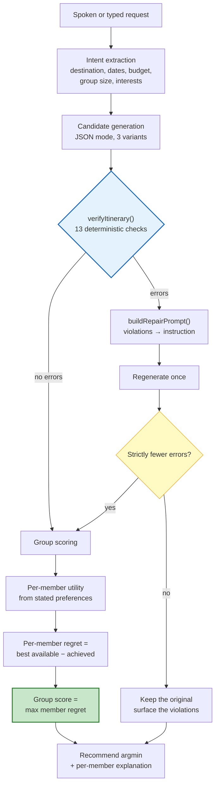

# Atlas AI — Project Report

**Author:** Harsh Tambade
**Date:** 31 August 2026
**Repository:** https://github.com/HarshTambade/Radiator-Routes
**Commit described:** `db7149a`
**Companion documents:** [`README.md`](../README.md) (operational) · [`AUDIT.md`](../AUDIT.md) (engineering audit) · [`docs/RESEARCH.md`](./RESEARCH.md) (prior art and novelty) · [`docs/BACKLOG.md`](./BACKLOG.md) (known defects)

---

## Contents

1. [Abstract](#1-abstract)
2. [Problem statement](#2-problem-statement)
3. [Objectives](#3-objectives)
4. [Background and related work](#4-background-and-related-work)
5. [System architecture](#5-system-architecture)
6. [Implementation of the three technical contributions](#6-implementation-of-the-three-technical-contributions)
7. [Supporting feature set](#7-supporting-feature-set)
8. [Engineering practice and quality assurance](#8-engineering-practice-and-quality-assurance)
9. [Results: what is verified](#9-results-what-is-verified)
10. [What is not verified](#10-what-is-not-verified)
11. [Limitations](#11-limitations)
12. [Reflection: what this project got wrong](#12-reflection-what-this-project-got-wrong)
13. [Future work](#13-future-work)
14. [Conclusion](#14-conclusion)
15. [References](#15-references)

---

## 1. Abstract

Atlas AI is a group travel planner for India, built as a browser-based progressive web
application. It takes a spoken sentence — *"plan five days in Goa for four friends under
₹40,000"* — and produces a day-by-day itinerary.

The engineering interest is not the itinerary generation, which a language model does adequately.
It is the three things wrapped around it:

1. **A deterministic client-side verifier.** Language models produce travel plans that parse
   perfectly and are physically impossible. On the TravelPlanner benchmark, GPT-4 satisfies the full
   constraint set of a realistic trip in 0.6% of cases [1]. Rather than trusting the model, every
   generated plan is checked in code against 13 constraints — budget, cost arithmetic, time overlap,
   travel feasibility, opening hours, coordinate sanity, daily pace — and failures are fed back to
   the model once as a targeted repair instruction. This places the design in the *LLM-Modulo*
   family that the planning literature converges on [3, 4].

2. **A group fairness score that is computed rather than asserted.** An earlier version of this
   project displayed a "regret score" that the prompt had told the model to emit. It was a constant
   dressed as a measurement. It now computes each member's utility from their own stated
   preferences, derives each member's regret against the best plan available to them, and recommends
   the plan minimising the *worst* member's regret — Least Misery, a group-recommendation strategy
   established since 2004 [8].

3. **Optional fully-local operation.** The same planning surfaces run either against hosted Groq
   LLaMA 3.3 70B or against a quantised 1–8 B model executing in the browser on WebGPU via
   WebLLM [12]. In the second mode no prompt leaves the device, and with a saved trip and
   pre-cached map tiles the planner works with the network off.

Every mechanism above is implemented and covered by unit tests: 228 tests across 9 files, zero
lint errors, zero dependency vulnerabilities across 882 packages.

**None of it has been evaluated.** There is no measurement showing the verifier improves plan
quality, that the repair pass recovers failures, or that computed regret predicts satisfaction.
Building a mechanism and demonstrating it works are different claims, and this report only earns
the first. Section 10 states precisely what is unknown, and Section 12 discusses why that
distinction became the most important thing the project taught.

---

## 2. Problem statement

### 2.1 The user problem

Group travel planning fails in a specific, familiar way. Four people want different things, share
one budget, and coordinate over a chat thread where decisions scroll out of view. The work that
actually needs doing — reconciling incompatible preferences under a shared constraint — is exactly
the work no existing tool does. Online travel agencies optimise for booking conversion, not for the
argument about whether Tuesday is a beach day.

Three consequences follow, and they shaped the system:

- **Preference reconciliation is manual and invisible.** Whoever plans loudest wins. There is no
  artefact recording that Bikram gave up Old Goa so Chitra could have the night market.
- **Plans are brittle in exactly the conditions travel produces.** Weather turns, a train slips, a
  market is shut on the day you arrive.
- **Connectivity is assumed.** Every mainstream planner needs a live connection to show you the
  plan you already made.

### 2.2 The connectivity problem, specifically

India's travel growth is concentrated in tier-2 and tier-3 cities [15, 17] — precisely where mobile
data is least reliable. A planner that requires connectivity to display a saved itinerary fails at
the moment of use: standing at a trailhead, underground, or roaming abroad.

This is not a hypothetical. It is the ordinary condition of the target user, and it motivated
treating offline operation as a functional requirement rather than a resilience nicety.

### 2.3 The reliability problem with language models

The naive architecture — prompt a model, render what it returns — does not work for this domain, and
the literature is unambiguous about why. TravelPlanner measured GPT-4 at a **0.6% success rate** on
realistic travel planning, attributing failure to agents losing track of multiple simultaneous
constraints [1]. Broader planning benchmarks put autonomous executable-plan generation at roughly
**12%** for GPT-4 [4]. The most capable reasoning models improve on this but do not solve it [6].

Critically, the obvious fix does not work either. Asking a model to check its own plan causes
measurable **performance collapse**, while supplying a *sound external check* and re-prompting
produces significant gains [5]. Feedback granularity — detailed versus a bare pass/fail — had
minimal impact [7].

That last finding is inconvenient for this implementation, and Section 12 returns to it.

---

## 3. Objectives

| # | Objective | Status | Evidence |
|---|---|---|---|
| O1 | Generate a day-by-day group itinerary from natural speech, with no forms | ✅ Met | `services/aiPlanner.ts`, Web Speech API in `services/groqVoice.ts` |
| O2 | Reject generated plans that are infeasible, deterministically and on-device | ✅ Met | `lib/itineraryVerifier.ts` — 13 checks, 26 tests |
| O3 | Repair a failed plan automatically rather than only reporting it | ✅ Met | `lib/planRepair.ts` — 21 tests |
| O4 | Compute a group fairness score from real member preferences | ✅ Met | `lib/groupRegret.ts` (36 tests) + `lib/travelPreferences.ts` (33 tests) |
| O5 | Run the full planning path with no network and no API key | ✅ Met | `services/webllm.ts`, `lib/aiProvider.ts` |
| O6 | Open a saved trip and its maps with no connection | ✅ Met | `services/offlineTrip.ts`, Workbox `CacheFirst` |
| O7 | Preserve edits made offline | ⚠️ Partial | `lib/offlineMutation.ts` — activity writes only |
| O8 | Use no paid API anywhere | ✅ Met | Only Supabase required; all others free-tier or keyless |
| O9 | Operate in the user's own language | ✅ Met | 29 languages, 12 Indian, RTL for Arabic and Urdu |
| O10 | **Demonstrate that O2–O4 improve outcomes** | ❌ **Not met** | No evaluation run. See §10. |

O10 is listed deliberately. It was not an original objective, and its absence is the most
significant finding in this report.

---

## 4. Background and related work

A full treatment, including 16 patents and roughly 60 papers, is in
[`docs/RESEARCH.md`](./RESEARCH.md). This section covers only what bears directly on the design.

### 4.1 Why an external verifier, and not self-critique

The planning literature has converged on a position with unusual consistency:

| Finding | Source |
|---|---|
| LLM plan generation "falls quite short" even for state-of-the-art models on IPC-derived domains | PlanBench [2] |
| GPT-4 averages ~12% autonomous executable-plan generation; the LLM-Modulo setting with external verifiers "shows more promise" | [4] |
| Auto-regressive LLMs cannot plan *or self-verify*; pair them with external model-based verifiers in a bi-directional generate–test loop | Kambhampati et al. [3] |
| **Performance collapses under self-critique; significant gains under sound external verification. Merely re-prompting with a sound verifier retains most of the benefit** | Stechly et al. [5] |
| LLMs fail multi-constraint plans even with self-verification; pairing with a formal solver fixes it | [16] |

The architecture in this project — generate with the model, verify in code, re-prompt once on
failure — is the shape those results recommend. The single-pass design is not a shortcut: [5]
specifically reports that plain re-prompting with a sound verifier captures most of the available
gain, which makes elaborate multi-round critique poor value.

Two honest qualifications:

- **Every cited gain is conditional on the verifier being sound.** A check that passes bad plans
  offers no guarantee. The soundness of `lib/itineraryVerifier.ts` is asserted by 26 unit tests, not
  proved.
- **The strongest reported TravelPlanner improvement is not a verification result.** Collaborative
  multi-agent decomposition reaches 42.68% against GPT-4's 2.92% [9]. Any future comparison should
  be against that number, not the 0.6% headline.

### 4.2 What operations research already solved

The constraints this system checks — opening hours, travel-time feasibility, per-day budgets — are
the defining constraints of the **Team Orienteering Problem with Time Windows**, for which exact
MILP formulations and mature metaheuristics exist [10, 11, 13, 14].

This project does not solve TOPTW. It asks a model to guess and then checks a subset of the
constraint set arithmetically. Against the OR literature that is strictly weaker: a solver returns
an optimal feasible tour, this returns a guess with 13 checks applied and one repair attempt.

The trade is deliberate. TOPTW solvers require a curated POI graph with reliable hours, travel
matrices and profit values. This system has none of that. Under those conditions a verifier that
rejects the clearly impossible runs client-side in milliseconds, and a MILP does not. **The
contribution is the deployment envelope, not the algorithm** — and no claim of optimisation is made
anywhere in the product.

### 4.3 Group recommendation

Minimising the maximum individual dissatisfaction is **Least Misery**, and Masthoff's user studies
found that people genuinely reason this way and care about avoiding individual misery [8]. The
implementation cites this and positions itself as an application, not an invention.

A related finding is directly relevant and untested here: a 2023 study found significant differences
between aggregation *strategies* but **no benefit from social-choice explanations** — which is
precisely what the "Why This Plan" panel provides.

### 4.4 On-device inference

WebLLM compiles quantised models to WebGPU kernels via MLC-LLM and Apache TVM, retaining up to
**80% of native performance** in-browser [12]. Novelty cannot rest on using it. It rests, if
anywhere, on composing local inference with locally cached geospatial data so that generation
completes with no network egress.

One caveat must be stated: WebGPU exposes GPU characteristics usable for fingerprinting, so
"on-device therefore private" is not unconditional.

---

## 5. System architecture

### 5.1 Stack

| Layer | Choice |
|---|---|
| UI | React 18.3, TypeScript 5.9, Tailwind 3.4, hand-rolled components (no component library) |
| Build | Vite 8.2 on Rolldown + Oxc; route-level `React.lazy` |
| State | TanStack Query 5 |
| Backend | Supabase — Postgres, PKCE auth, Realtime, Row-Level Security on every table |
| AI | Groq LLaMA 3.3 70B **or** WebLLM on WebGPU (LLaMA 3.2 1B/3B, Qwen 2.5 1.5B/3B, Phi 3.5 Mini, LLaMA 3.1 8B) |
| Speech | Web Speech API, with Groq Whisper as fallback |
| Maps | Leaflet + OpenStreetMap (2D), MapLibre GL (3D), Nominatim, OpenRouteService |
| Live data | Open-Meteo, Wikipedia/Wikimedia REST, OpenTripMap |
| Offline | vite-plugin-pwa + Workbox, IndexedDB via `idb` |

Only Supabase is required. Every other integration degrades gracefully when its key is absent, and
no paid API exists anywhere in the stack.

### 5.2 The planning pipeline



Two design decisions in that diagram are worth calling out.

**The repair pass must strictly improve.** A regenerated plan replaces the original only if it has
*fewer* errors. An equal-scoring second attempt keeps the first. This prevents the plan visibly
swapping out for no measured gain — a small thing that matters because the user is watching.

**Scoring is downstream of verification.** An infeasible plan is never scored for fairness. Ranking
impossible options by how fair they are would be meaningless.

### 5.3 Dual-backend dispatch

`services/gemini.ts` is a single dispatch point. `callGemini`, `callGeminiChat` and `streamGemini`
keep identical signatures across both backends, so `aiPlanner`, `dynamicReplan`, `travelMemory` and
`AccessibilityPanel` required no changes when the on-device backend was added.

Three constraints shaped it:

- **`@mlc-ai/web-llm` is dynamically imported.** It is ~5.9 MB and the worker bundles its own copy.
  Both are excluded from service-worker precache via `globIgnores`; without that, every visitor
  would pay 11.7 MB on first load. A runtime `CacheFirst` rule caches them after first use so
  on-device inference still works offline.
- **Inference runs in a Web Worker** so token generation does not block the UI, falling back to the
  main thread if worker construction fails.
- **Nothing downloads without an explicit click.** Multi-gigabyte weights on a metered connection
  are not an accident worth risking.

WebGPU detection is a two-stage probe: `navigator.gpu` must exist **and** `requestAdapter()` must
resolve. A browser can expose the API and still refuse an adapter, so checking only the first gives
a false positive. If the probe fails the reason is shown and the option is disabled.

### 5.4 The offline path

```
Phase 1 — online, once per trip
  Save trip        → trip + itineraries + activities → IndexedDB
  Geocode          → destination → lat/lng anchor
  Pre-cache tiles  → ~173 OSM tiles, z10–z14, concurrency 6 → osm-tiles-offline
  (optional) Model → quantised weights → WebLLM cache

Phase 2 — offline
  Launch PWA       → service worker serves the app shell
  Read trip        → IndexedDB
  Render map       → cached tiles via Workbox CacheFirst
  Revise plan      → on-device model → verifier → repair
  Edit activity    → mutateWithOfflineQueue → durable IndexedDB queue

Phase 3 — connectivity returns
  useOfflineSync   → replay queued mutations in seq order
                   → updated_at mismatch ⇒ reject stale write, report it
                   → invalidate only the touched query keys
```

The tile pre-cache writes to `osm-tiles-offline`, the same cache name the Workbox `CacheFirst` rule
reads. That alignment is load-bearing and easy to break silently — it is the reason maps work
offline at all.

---

## 6. Implementation of the three technical contributions

### 6.1 Deterministic plan verification

`lib/itineraryVerifier.ts` exports `verifyItinerary()`, returning typed violations with a severity.
The 13 codes:

| Code | Catches |
|---|---|
| `BUDGET_EXCEEDED` | Total cost over the stated budget |
| `COST_SUM_MISMATCH` | Per-activity costs not summing to the declared total — the model contradicting itself |
| `TIME_OVERLAP` | Two activities occupying the same interval |
| `TIME_INVALID` | Unparseable timestamps |
| `TIME_REVERSED` | End before start |
| `TRAVEL_INFEASIBLE` | Consecutive activities too far apart for the gap between them |
| `PACE_EXCEEDED` | More activities per day than the group declared tolerable |
| `COORD_INVALID` | Coordinates outside valid lat/lng ranges |
| `COORD_OUT_OF_REGION` | Coordinates outside the destination's plausible bounding box — a POI hallucinated onto another continent |
| `EMPTY_ITINERARY` | No activities generated |
| `DURATION_IMPLAUSIBLE` | An activity length that makes no sense |
| `CLOSED_ON_DAY` | Scheduled on a weekday the place is shut |
| `OUTSIDE_OPENING_HOURS` | Within an open day, but outside operating hours |

Distance uses the haversine formula against a speed assumption for the available gap. Two of these
checks were not in the original design — `COST_SUM_MISMATCH` and `COORD_OUT_OF_REGION` were added
after observing those exact failures in generated output.

**Worked example.** The following is schema-valid JSON that `response_format: json_object` accepts
without complaint:

```json
{
  "activities": [
    { "name": "Dudhsagar Falls", "start_time": "2026-03-15T09:00:00+05:30",
      "end_time": "2026-03-15T13:00:00+05:30",
      "location_lat": 15.3144, "location_lng": 74.3144, "cost": 2500 },
    { "name": "Anjuna Flea Market", "start_time": "2026-03-15T13:30:00+05:30",
      "end_time": "2026-03-15T17:00:00+05:30",
      "location_lat": 15.5735, "location_lng": 73.7400, "cost": 1500 }
  ],
  "total_cost": 41200
}
```

The verifier rejects it on three independent grounds: the total exceeds a ₹40,000 budget; the two
locations are ~62 km apart with a 30-minute gap; and Anjuna's market runs on Wednesdays while
15 March 2026 is a Sunday. **None of these are syntactic**, which is exactly why grammar-constrained
decoding cannot catch them.

`lib/openingHours.ts` handles the third. It parses whatever is in `activities.opening_hours` and
answers one question: is the place open for the *whole* of this activity's window? Unknown hours are
treated as unverifiable rather than as closed, which avoids rejecting plans for missing data.

**An honest weakness.** `opening_hours` is currently populated by the model and tagged
`source: "model"`, so these two checks emit warnings rather than blocking errors. The mechanism is
sound; the data is self-reported. Backfilling authoritative hours from OSM/Overpass would let them
become hard errors, and until that happens *"enforces opening hours"* would overstate what happens —
the system *checks* them against a source that could be wrong.

### 6.2 Computed group regret

`lib/groupRegret.ts` implements Least Misery over computed utilities:

```
For group G = {m₁…mₙ} and candidate plans P = {p₁…pₖ}:

  1. uᵢ(p)  — member i's utility for plan p, from their stated
              category weights, review scores and budget cap
  2. rᵢ(p) = max_{q ∈ P} uᵢ(q) − uᵢ(p)      per-member regret
  3. R(p)  = max_i rᵢ(p)                     group regret (Least Misery)
  4. recommend argmin_{p ∈ P} R(p)
```

Worked through with three travellers:

| Plan | u(Asha) | u(Bikram) | u(Chitra) | r(Asha) | r(Bikram) | r(Chitra) | **R = max r** |
|---|---|---|---|---|---|---|---|
| Beach-heavy | 0.85 | 0.40 | 0.55 | 0.00 | 0.45 | 0.35 | **0.45** |
| Heritage-heavy | 0.35 | 0.85 | 0.50 | 0.50 | 0.00 | 0.40 | **0.50** |
| **Mixed + food** | 0.65 | 0.70 | 0.90 | 0.20 | 0.15 | 0.00 | **0.20** ✅ |

Each member sees their own number, which makes the compromise explicit: *"Asha, this plan costs you
0.20 against a beach-only trip — two beach mornings instead of four, in exchange for Bikram getting
Old Goa and Chitra getting the Saturday market."*

The properties that matter are that it is **computed, falsifiable and explainable per member**. It
can be wrong, which is the entire point — the thing it replaced could not be.

`lib/travelPreferences.ts` and `components/TravelPreferencesForm.tsx` supply the input. When a
member has stated nothing, the planner reports *"not scored"* rather than substituting a default.
That keeps the metric honest at the cost of the feature being invisible until a group fills the form
in — an adoption problem the design did not anticipate.

**Terminology.** This is not counterfactual regret minimisation. CFR is iterative self-play over an
extensive-form game approximating a Nash equilibrium; there is no game tree and no repeated play
here. Step 2 is anticipated regret in the Loomes–Sugden and Bell sense. The distinction is laboured
because an earlier version of this project used the wrong term.

### 6.3 On-device inference

| | Hosted (Groq) | On-device (WebLLM) |
|---|---|---|
| Model | LLaMA 3.3 70B | LLaMA 3.2 1B/3B, Qwen 2.5 1.5B/3B, Phi 3.5 Mini, LLaMA 3.1 8B |
| API key | Free-tier key | None |
| Network | Every request | One-time weight download |
| Prompts | Sent to Groq | Never leave the device |
| Offline | No | Yes, once cached |
| Quality | Highest | Lower — 1–8 B against 70 B |
| Entry cost | Signup | 0.7–4.3 GB download, WebGPU browser |

All model IDs are verified against `prebuiltAppConfig.model_list` in `@mlc-ai/web-llm` 0.2.84,
q4f16_1 quantised, 4096-token context. Requirements: WebGPU (Chrome/Edge 113+, Chrome Android 121+,
Safari 26+) and roughly as much free GPU memory as the model.

The composition that matters is not WebLLM itself but what surrounds it: with a saved trip in
IndexedDB, tiles in the Cache API and weights cached locally, **itinerary generation and
verification complete with zero network egress.** The verifier is pure arithmetic and was written to
have no network dependency, so it runs identically offline — which is what makes local generation
trustworthy rather than merely possible.

---

## 7. Supporting feature set

Around the three contributions sits the application that makes them useful.

| Area | Capability |
|---|---|
| **Real-time** | Live location sharing between trip members over Supabase Presence, 5 s refresh, auto-clear on disconnect · timeline alerts 15 and 5 minutes before each activity with one-tap bulk delay · group chat · disruption-triggered replanning |
| **Live data** | 7-day Open-Meteo forecast with severe weather fed into planning · time-of-day traffic estimation · Wikipedia place context |
| **Maps** | 2D Leaflet, 3D MapLibre globe, 360° street view, AR attraction viewer, ORS distance/ETA/elevation |
| **Money** | Expense splitting equal/custom/percentage with settlement tracking · UPI P2P deep-links · ₹-native with country-aware formatting |
| **Social** | Friend requests and DMs · trip invite codes with organiser approval · community groups with events and RSVPs |
| **Safety** | SOS panel with local emergency numbers and live GPS · destination advisories from Wikipedia REST plus curated regional guidance |
| **Accessibility** | 5-tab panel (Speak, Listen, Camera, Ask AI, Settings) with voice navigation · high-contrast and large-text modes |
| **i18n** | 29 languages including 12 Indian, in native scripts, RTL for Arabic and Urdu |
| **Offline** | Installable PWA · saved trips and pre-cached tiles readable offline · durable mutation queue for activity edits |
| **Export** | A4 day-by-day PDF via jsPDF, dynamically imported |

---

## 8. Engineering practice and quality assurance

### 8.1 Verification gate

`npm run verify` runs typecheck → lint → tests → production build. It is the gate every change
passes.

### 8.2 Documentation as an accountability mechanism

Four documents exist because one was not enough:

| Document | Answers |
|---|---|
| `README.md` | How do I run and understand this? |
| `AUDIT.md` | What was measured, and what was found wrong? |
| `docs/RESEARCH.md` | What is genuinely novel against prior art? |
| `docs/BACKLOG.md` | What is broken and what is the fix? |

The most useful convention adopted was **recording claims that turned out to be false, rather than
quietly correcting them.** `AUDIT.md` §11 lists user-facing copy that advertised technology absent
from the codebase — pgvector semantic search, LangGraph agents, OpenAI GPT-4o, TomTom, Mappls, and
"Nash equilibrium" multi-agent negotiation. All were removed. `docs/RESEARCH.md` §3.2 preserves the
fabricated regret score in full, including the offending prompt lines.

This is uncomfortable to write and has been the single highest-value practice in the project. A
document that only records successes provides no evidence it is complete.

### 8.3 A worked example of the practice

While measuring the bundle for this report, the README's published figure of "≈171 kB initial
payload" did not survive checking. `dist/index.html` requests one entry script, one stylesheet and
16 `modulepreload` hints — and `modulepreload` *downloads*, it is not a passive hint. Summing those
18 files gzipped gives **~540 kB**.

Worse, `vendor-pdf` (~188 kB gzipped) is in that list, despite `jspdf` and `jspdf-autotable` being
imported *only* inside the export click handler:

```
grep -rn "jspdf" src/   →   only  import("jspdf")  /  import("jspdf-autotable")
```

Nothing imports them statically, so the chunk should not be preloaded. The likely cause is that
Vite 8's Rolldown pipeline emits preload hints for `advancedChunks` groups without distinguishing
dynamic-only chunks.

The old figure was not fabricated — it counted core JS, excluding CSS, icons, Radix, the route chunk
and the preload hints. But it was not what a browser downloads. The README now states the measured
number and the defect is filed as `docs/BACKLOG.md` §3.10 with a three-step fix. **It is recorded as
an open bug, not reframed as a trade-off.**

---

## 9. Results: what is verified

### 9.1 Test coverage

228 tests across 9 files, all passing:

| Suite | Tests | Covers |
|---|---|---|
| `openingHours.test.ts` | 46 | Hours parsing, containment, closed-day detection, unknown-data handling |
| `groupRegret.test.ts` | 36 | Utility computation, per-member regret, Least Misery aggregation, argmin selection |
| `travelPreferences.test.ts` | 33 | Preference validation, normalisation, round-tripping through `profiles.preferences` |
| `offlineMutation.test.ts` | 31 | Queue-on-failure, FIFO ordering, retriable vs permanent failures, replay, invalidation keys |
| `itineraryVerifier.test.ts` | 26 | All 13 violation codes, severity assignment, haversine feasibility |
| `planRepair.test.ts` | 21 | Repair prompt construction, strict-improvement rule, verification merging |
| `aiProvider.test.ts` | 19 | Provider selection, persistence, WebGPU probe, model catalogue integrity |
| `idbOfflineTrips.test.ts` | 15 | IndexedDB persistence, legacy store migration |
| `example.test.ts` | 1 | Harness sanity |

Two tests deserve mention as behaviour worth locking down:

- `offlineMutation` asserts that a permission error (Postgres `42501`) **throws instead of queueing**.
  Queueing an RLS rejection would hide a real failure behind an optimistic "saved offline".
- `planRepair` asserts that an equal-scoring repair **keeps the original plan**.

### 9.2 Build and security

| Metric | Value |
|---|---|
| Typecheck | Clean |
| Lint | 0 errors, 157 warnings (`any` at network boundaries, tracked as `BACKLOG.md` §3.7) |
| `npm audit` | **0 vulnerabilities** across 882 packages |
| Production build | Succeeds; 2,367 modules |
| Service-worker precache | 91 entries, ~4.7 MB |
| Measured first load | ~540 kB gzipped (~319 kB excluding the `vendor-pdf` defect) |
| Hardcoded credentials in `src/` | None — scanned for JWT, `sk-` and `gsk_` patterns |

### 9.3 Architectural results

- **Zero paid APIs.** Amadeus, TomTom, Mappls, GNews and OpenAI were each replaced with a free
  provider or a deep-link. Only Supabase is required.
- **Row-Level Security on every table**, with the request cache purged on sign-out so cached rows do
  not survive a session.
- **Offline generation works.** With weights and tiles cached, a plan can be generated, verified and
  revised with the network disabled.

---

## 10. What is not verified

This section is the counterweight to Section 9 and is deliberately specific.

> Every mechanism described in Section 6 is implemented and unit-tested. **Not one has been shown to
> improve an outcome.**

| Question | Status | Cost to answer |
|---|---|---|
| What fraction of generated plans fail verification? | Unknown — no production instrumentation counts violations by code | Low |
| Does the repair pass fix them? | Unknown — `planRepair` computes before/after error counts to apply its strict-improvement rule, then **discards them** | Low |
| Does detailed feedback beat a binary signal? | Unknown, and [7] suggests it may not | Low — one A/B over a fixed prompt set |
| Does computed regret predict member satisfaction? | Unknown. The claim that matters most, and the hardest to test — needs human subjects | High |
| Do 1–8 B on-device models benefit from verification as much as a 70 B hosted model? | Unknown. **This is the actual research question** | Medium |
| On-device load time, tokens/sec, GPU memory | Never benchmarked on real hardware | Low |

The first three are hours of work. They would convert *"we built a verifier"* into *"the verifier
rejects N% of plans and the repair pass recovers M% of them"* — the difference between a system
description and a result.

The evaluation protocol is written and unexecuted in [`docs/RESEARCH.md`](./RESEARCH.md) §8.3. Its
central study compares four conditions: hosted 70 B unverified, on-device 3 B unverified, on-device
3 B plus verifier, on-device 1 B plus verifier. The hypothesis is that the third beats the first. **If
it does, that is a genuine result. If it does not, that is also a result** — and reporting it either
way is the point.

---

## 11. Limitations

**Scope of offline operation.** Reads and activity edits work offline. Trip creation, expenses, chat
and community posts still require the network. *"Works offline"* is true only with that scope stated.

**Conflict handling is detection, not resolution.** `activities.updated_at` lets a stale replay be
rejected rather than silently overwriting. No merge is attempted; the losing edit is discarded with a
message. This is optimistic locking, not CRDT convergence.

**Opening-hours data is self-reported.** Covered in §6.1. The checks are sound; the data may not be.

**Single-pass repair is untested in this domain.** Justified by [5], but that result comes from
block-stacking and logic domains, not itinerary planning.

**No accessibility constraint checking.** The original verifier design included cross-referencing
wheelchair-required members against POI accessibility. It was not implemented.

**On-device vision degrades silently.** `AccessibilityPanel` sends image-description prompts through
the shared dispatch, and all six curated on-device models are text-only.

**WebGPU availability is a selection effect.** Users with capable GPUs are not representative of the
low-connectivity population this work targets. This tension is real and unresolved.

**"On-device therefore private" is qualified.** WebGPU exposes GPU state usable for fingerprinting.

**PWA support in embedded browsers is inconsistent.** If trips are shared via WhatsApp, the in-app
browser may not support service workers or WebGPU at all.

**No independent evaluation.** The author is the sole developer and evaluator.

**`vendor-pdf` ships on first load.** ~188 kB gzipped for a feature most visitors never use — an open
defect (`BACKLOG.md` §3.10).

---

## 12. Reflection: what this project got wrong

Three mistakes were more instructive than the features.

### 12.1 A metric that could not be wrong

The original "regret score" was written into the prompt as a constant, emitted by the model, and
rendered in the UI as `Regret Score: 0.20` with the gloss *"Low regret — you'll likely be happy with
this choice."*

It was unfalsifiable by construction. It could never be wrong because it was never computed. A user
reasonably read it as an assessment of their trip; it was a number from a template. The ordering
even embedded an assumption — that spending more means less regret — which is exactly the sort of
claim a real metric would test rather than assert.

The lesson generalises past this bug: **a number that cannot be wrong is not a measurement, and
displaying one is a misrepresentation regardless of intent.** The replacement in §6.2 is worse-looking
in one respect — it sometimes says "not scored" — and that is a feature.

### 12.2 Documentation that described intentions

The landing page and HTML metadata advertised pgvector semantic search, LangGraph agents, OpenAI
GPT-4o, TomTom traffic and Nash-equilibrium multi-agent negotiation. None existed. The structured
data even carried a fabricated `aggregateRating` of 4.9 from 1,200 reviews for a product with no
review system.

None of this was deliberate deception. It accumulated: an aspiration written down as a feature, then
never revisited. That is the ordinary way documentation becomes false, and the only defence found
was periodic adversarial re-reading of the codebase's own claims — which is what `AUDIT.md` is.

### 12.3 Mistaking mechanism for result

This is the one still uncorrected, and the most important.

Considerable effort went into building the verifier, the repair loop and the fairness score. All
three work. At no point did the project stop and measure whether any of them improved anything. The
data needed to answer the most basic question — *does the repair pass help?* — is computed inside
`planRepair` to apply its strict-improvement rule and then thrown away. Persisting it is a few lines.

There is a specific failure mode here that a verifier does not protect against: the satisfaction of
having built the right thing, mistaken for evidence that it works. The literature in §4.1 says
external verification helps. It does not say *this* verifier helps *this* model on *this* domain,
and only measurement can.

The honest summary is that this project built a well-engineered, well-documented, thoroughly tested
system and **does not know whether its central ideas work.**

---

## 13. Future work

In priority order. The first three are hours, not weeks, and are ordered ahead of every feature.

1. **Instrument the verifier.** Log violation counts by code in production. Answers "how often does
   this fire?" — currently unknown.
2. **Persist repair outcomes.** `planRepair` already computes before/after error counts. Store them.
3. **A/B detailed versus binary repair feedback.** [7] suggests specificity may buy nothing. One
   experiment settles it, and a negative result would simplify `buildRepairPrompt` considerably.
4. **Benchmark on-device inference** across device classes: cold and warm load, tokens/sec, peak GPU
   memory, thermal behaviour over consecutive generations.
5. **Run Study 2** (`RESEARCH.md` §8.3) — the four-condition constraint-satisfaction comparison. This
   is the project's actual research question.
6. **Fix the `vendor-pdf` preload defect** (`BACKLOG.md` §3.10).
7. **Backfill authoritative opening hours** from OSM/Overpass so those checks can block rather than
   warn.
8. **Extend offline writes** beyond activity edits.
9. **Connectivity-aware degradation** — let the planner adapt strategy to observed conditions: smaller
   model, fewer candidates, verifier-only mode when the model cannot load. Currently the backend is a
   static user preference.
10. **Group user study** with real groups of 3–5, testing whether computed regret predicts reported
    dissatisfaction, and comparing Least Misery against Average and Average Without Misery. Requires
    ethics approval.

---

## 14. Conclusion

Atlas AI generates group travel itineraries from speech, checks them in code against 13
feasibility constraints, repairs failures by feeding violations back to the model, scores the result
for group fairness using arithmetic rather than assertion, and can run the entire path on the user's
own GPU with no network and no API key. It does this on a stack containing no paid API, in 29
languages, with Row-Level Security on every table and zero dependency vulnerabilities.

The architecture is the one the planning literature recommends. LLMs are unreliable planners under
multiple constraints [1, 2, 4], self-critique does not fix it, and sound external verification
does [3, 5]. This system is an LLM-Modulo design applied under a constraint that literature has not
examined: a small quantised model in a browser with no network.

Two things are worth separating in any assessment of this work.

**What it demonstrates:** that the composition is buildable and behaves correctly under test. 228
tests, a clean verification gate, and four documents that record what is broken alongside what works.

**What it does not demonstrate:** that any of it improves an outcome. The verifier's firing rate is
unmeasured. The repair pass's success rate is computed and discarded. Whether computed regret tracks
real satisfaction is unknown and needs human subjects.

That gap is the honest conclusion. It is also the most valuable thing the project produced: a
concrete, well-posed, cheap-to-answer research question, sitting on a codebase already instrumented
to answer it. The next contribution this project makes should not be a feature. It should be a table
with numbers in it.

---

## 15. References

Full reference list, including 16 patents and market context, in
[`docs/RESEARCH.md`](./RESEARCH.md) §11.

1. Xie, J. et al. (2024). *TravelPlanner: A Benchmark for Real-World Planning with Language Agents.* arXiv:2402.01622. https://arxiv.org/abs/2402.01622
2. Valmeekam, K. et al. (2023). *PlanBench: An Extensible Benchmark for Evaluating Large Language Models on Planning and Reasoning about Change.* NeurIPS 2023 Datasets & Benchmarks. arXiv:2206.10498. https://arxiv.org/abs/2206.10498
3. Kambhampati, S. et al. (2024). *LLMs Can't Plan, But Can Help Planning in LLM-Modulo Frameworks.* ICML 2024. arXiv:2402.01817. https://arxiv.org/abs/2402.01817
4. Valmeekam, K. et al. (2023). *On the Planning Abilities of Large Language Models: A Critical Investigation.* arXiv:2305.15771. https://arxiv.org/abs/2305.15771
5. Stechly, K., Valmeekam, K. & Kambhampati, S. (2024). *On the Self-Verification Limitations of Large Language Models on Reasoning and Planning Tasks.* arXiv:2402.08115. https://arxiv.org/abs/2402.08115
6. Valmeekam, K., Stechly, K. & Kambhampati, S. (2024). *LLMs Still Can't Plan; Can LRMs? A Preliminary Evaluation of OpenAI's o1 on PlanBench.* arXiv:2409.13373. https://arxiv.org/abs/2409.13373
7. Stechly, K., Marquez, M. & Kambhampati, S. (2023). *Can Large Language Models Really Improve by Self-critiquing Their Own Plans?* arXiv:2310.08118. https://arxiv.org/abs/2310.08118
8. Masthoff, J. (2004). *Group Modeling: Selecting a Sequence of Television Items to Suit a Group of Viewers.* UMUAI. https://link.springer.com/chapter/10.1007/1-4020-2164-X_5
9. Zhang, H. et al. (2024). *Planning with Multi-Constraints via Collaborative Language Agents.* arXiv:2405.16510. https://arxiv.org/abs/2405.16510
10. Gavalas, D., Konstantopoulos, C., Mastakas, K. & Pantziou, G. (2014). *A survey on algorithmic approaches for solving tourist trip design problems.* Journal of Heuristics 20(3). https://www.researchgate.net/publication/271921760_A_survey_on_algorithmic_approaches_for_solving_tourist_trip_design_problems
11. Vansteenwegen, P. et al. *Metaheuristics for Tourist Trip Planning.* https://www.researchgate.net/publication/226088125_Metaheuristics_for_Tourist_Trip_Planning
12. Ruan, C.F. et al. (2024). *WebLLM: A High-Performance In-Browser LLM Inference Engine.* arXiv:2412.15803. https://arxiv.org/abs/2412.15803
13. *Time-Dependent Tourist Tour Planning with Adjustable Profits.* ATMOS 2020, OASIcs vol. 85. DOI 10.4230/OASIcs.ATMOS.2020.14. https://drops.dagstuhl.de/storage/01oasics/oasics-vol085-atmos2020/OASIcs.ATMOS.2020.14/OASIcs.ATMOS.2020.14.pdf
14. Gavalas, D. et al. (2016). *Efficient Metaheuristics for the Mixed Team Orienteering Problem with Time Windows.* Algorithms 9(1):6. https://www.mdpi.com/1999-4893/9/1/6
15. Anand Rathi Investment Banking, via ET Travel (2026). *India tourism to grow at 7% till FY35.* http://travel.economictimes.indiatimes.com/news/research-and-statistics/india-tourism-to-grow-at-7-till-fy35-ai-young-travellers-to-drive-growth-report/131217788
16. *Large Language Models Can Solve Real-World Planning Rigorously with Formal Verification Tools.* arXiv:2404.11891. https://arxiv.org/abs/2404.11891
17. Euromonitor. *Travel in India.* https://www.euromonitor.com/travel-in-india/report
18. Kleppmann, M., Wiggins, A., van Hardenberg, P. & McGranaghan, M. (2019). *Local-First Software: You Own Your Data, in spite of the Cloud.* Onward! 2019. https://www.cl.cam.ac.uk/research/dtg/www/files/publications/public/mk428/local-first.pdf
19. Geng, S. et al. (2023). *Grammar-Constrained Decoding for Structured NLP Tasks without Finetuning.* arXiv:2305.13971. https://arxiv.org/abs/2305.13971
20. Loomes, G. & Sugden, R. (1982). *Regret Theory: An Alternative Theory of Rational Choice Under Uncertainty.* Economic Journal 92(368):805–824. https://philpapers.org/rec/LOORTA

**Compliance note.** All sources are cited inline with links. External content was paraphrased and
summarised rather than reproduced; no more than 30 consecutive words are taken from any single
source. Content was rephrased for compliance with licensing restrictions. Reported figures —
including TravelPlanner's 0.6% success rate, GPT-4's ~12% autonomous planning rate, PMC's 42.68%,
and WebLLM's 80% native-performance retention — are preserved as stated by their original authors.

---

### Primary sources in this codebase

| File | Role in this report |
|---|---|
| `src/lib/itineraryVerifier.ts` | §6.1 — the 13 checks |
| `src/lib/openingHours.ts` | §6.1 — time-window containment |
| `src/lib/planRepair.ts` | §6.1 — generate → verify → repair |
| `src/lib/groupRegret.ts` | §6.2 — Least Misery scoring |
| `src/lib/travelPreferences.ts` | §6.2 — preference elicitation |
| `src/lib/aiProvider.ts` | §6.3 — backend selection, WebGPU probe |
| `src/services/webllm.ts` | §6.3 — on-device inference |
| `src/lib/offlineMutation.ts` | §5.4 — durable mutation queue |
| `src/services/offlineTrip.ts` | §5.4 — trip persistence, tile pre-caching |
| `vite.config.ts` | §5.3, §8.3 — chunking and runtime caching |
