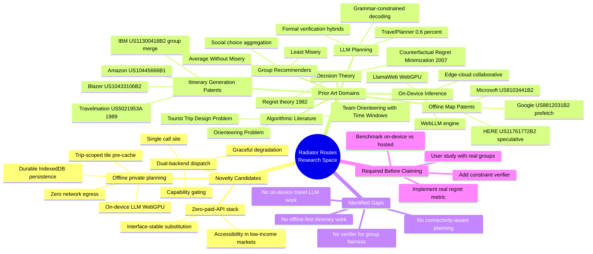
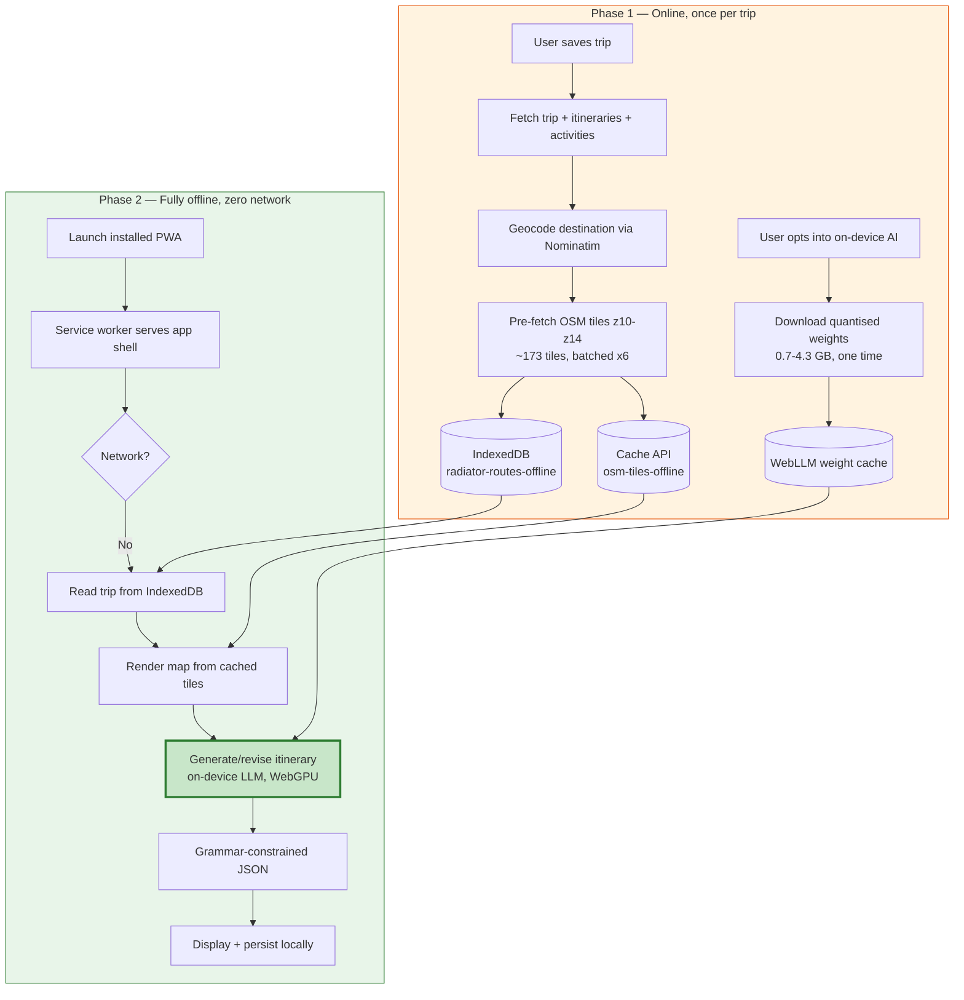
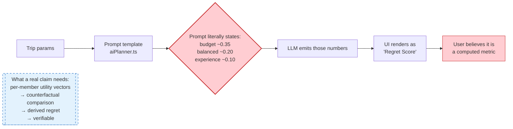
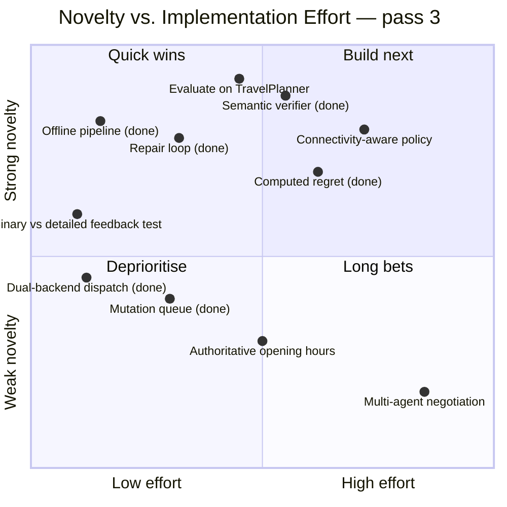
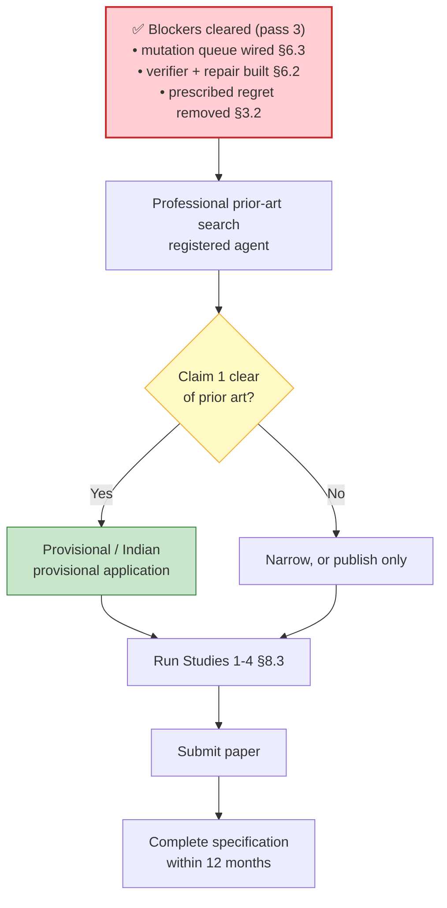

# Radiator Routes — Research & Patent Dossier

**Version:** 1.2 (pass 3)
**Date:** 31 August 2026 (v1.0: 30 August 2026)
**Codebase audited:** commit `db7149a`
**What changed in pass 3:** Gaps A, B and C are closed in code — see §3.1a. §5.4a and §5.4b are new
literature sections covering external verification versus self-critique, and the time-window
formalism the opening-hours checks now touch. §6.6 records the gap that replaced them: everything is
implemented and nothing is measured.
**Purpose:** Establish what is genuinely novel in this system, map it against existing patents and
literature, and identify what must be built before any claim is defensible.

> ### ⚠️ Read this before using this document
>
> **1. This is not legal advice.** I am not a patent attorney. The prior-art list below comes from
> public keyword searches, not a professional freedom-to-operate or patentability search. A
> registered agent must run a proper search before you file anything. Filing on a claim that reads
> on existing art wastes money and can create estoppel problems.
>
> **2. Several capabilities the project has advertised do not exist in the code.** §3 separates what
> is implemented from what is aspirational. **Do not write a paper or patent application around the
> aspirational items.** A patent claim that the specification does not enable is invalid under
> 35 U.S.C. §112; a paper claiming an unimplemented algorithm is misconduct. §3 exists so you don't
> do either by accident.
>
> **3. Publication destroys patent rights in most jurisdictions.** India and the EPO have **absolute
> novelty** requirements: publish first and you cannot patent. The US allows a 12-month grace
> period after your own disclosure. If you want both a patent and a paper, **file first, publish
> second**. §9 covers sequencing.
>
> ### 📌 Disclosure record
>
> **This document was published to the public repository `HarshTambade/Radiator-Routes` on
> 30 August 2026 by deliberate decision of the author, with the consequences in note 3 above
> understood.**
>
> For any future patent agent, the practical effect of that date:
>
> | Jurisdiction | Effect |
> |---|---|
> | **India** (absolute novelty) | Claim 1 (§7.1) is likely **barred**. Anything disclosed here is prior art against the author. |
> | **EPO** (absolute novelty) | Same as India. |
> | **US** (35 U.S.C. §102(b)(1)) | 12-month grace period from the author's own disclosure. **Deadline: 30 August 2027.** |
>
> A patent may still be available for material **not** disclosed here — in particular a fully
> implemented regret metric (§6.1), the verifier's specific repair algorithm (§6.2 describes only
> the constraint set, not a repair procedure), and the connectivity-aware degradation policy (§6.4),
> which is named but not specified. Treat everything actually written below as public.

---

## Table of Contents

1. [Executive summary](#1-executive-summary)
2. [Mind map](#2-mind-map)
3. [Novelty audit: what actually exists](#3-novelty-audit-what-actually-exists)
4. [Prior art — patents](#4-prior-art--patents)
5. [Prior art — academic literature](#5-prior-art--academic-literature)
6. [Gap analysis: where the white space is](#6-gap-analysis-where-the-white-space-is)
7. [Draft patent claims](#7-draft-patent-claims)
8. [Research paper plan](#8-research-paper-plan)
9. [Filing and publication sequence](#9-filing-and-publication-sequence)
10. [Worked examples](#10-worked-examples)
11. [Full reference list](#11-full-reference-list)
12. [Search methodology and limitations](#12-search-methodology-and-limitations)

---

## 1. Executive summary

### The honest position

Radiator Routes contains **one strong novelty candidate** and **several weak ones**. The strong one
is not the feature the project has been marketing.

| Candidate | Strength | Why |
|---|---|---|
| **Fully-offline private trip planning** — on-device LLM + trip-scoped map tile pre-caching + durable local persistence, composed so that itinerary generation completes with zero network egress | 🟢 **Strong** | Each ingredient exists in prior art; **the composition and its purpose do not.** Implemented and verifiable in code. |
| **Dual-backend AI dispatch with capability-gated fallback** — one call site serving hosted and on-device inference, degrading on WebGPU absence | 🟡 Moderate | Genuinely implemented and useful, but arguably an obvious engineering pattern. Better as a paper contribution than a patent. |
| **Zero-paid-API travel stack** — systematic substitution of every commercial API with free/open equivalents behind stable interfaces | 🟡 Moderate | Strong *engineering* and *accessibility* contribution. Weak patent subject matter (it's a design discipline, not a mechanism). |
| **Client-side semantic verification with a repair pass** — 13 deterministic checks over a generated itinerary, violations fed back once, all running offline with no solver and no server | 🟢 **Strong** *(new in pass 3)* | This is the LLM-Modulo pattern the planning literature converges on (§5.4a), applied under a deployment constraint that literature has not examined: a small quantised model in a browser with no network. Implemented; **not yet evaluated.** |
| **Computed group regret (Least Misery)** | 🟡 Moderate *(was 🔴)* | Now genuinely computed from elicited per-member preferences (`lib/groupRegret.ts`, 36 tests). The aggregation strategy itself is textbook ([Masthoff 2004](https://link.springer.com/chapter/10.1007/1-4020-2164-X_5)), so novelty is in the application, not the mechanism. Whether the score predicts satisfaction is **untested**. |
| ~~**Regret-aware counterfactual planning**~~ | 🔴 **Terminology retired** | The prescribed constant is gone. What replaced it is Least Misery over computed utilities — deliberately **not** described as counterfactual regret minimisation, which is a different thing (§3.2). |
| **Multi-agent group negotiation / Nash equilibrium** | 🔴 **Not implemented** | No per-member preference vectors feeding a solver, no aggregation to equilibrium. Closely anticipated by IBM US11300418B2 anyway. |

### One-line recommendation

**Pass 1 said:** file a narrow composition claim on the offline-private-planning pipeline (§7.1), and
write the paper about the honest negative result — that LLM-prescribed quality scores are
unfalsifiable, the failure mode [TravelPlanner](https://arxiv.org/abs/2402.01622) measured at a 0.6%
GPT-4 success rate.

**Pass 3 revises this.** The negative result was fixed rather than published: the prescribed score is
gone and generation is now wrapped in an external verifier with a repair pass (§3.1a). The
recommendation becomes:

> **The composition claim in §7.1 still stands and is now better enabled — it describes running,
> tested code rather than intent. But the project's binding constraint has moved from mechanism to
> evidence.** Every contribution above is implemented and unit-tested; not one has been shown to
> improve an outcome. The paper worth writing is no longer a confession, it is a measurement: *does
> external verification rescue a 1–8 B model running offline in a browser, and by how much?* That
> question is well-posed, the harness is mostly built, and the answer is unknown. Until it is
> answered, §5.4a's claim that this architecture is "the recommended one" rests entirely on other
> people's experiments in other domains. See §6.6.

---

## 2. Mind map

### 2.1 Overall research landscape



### 2.2 The offline-private pipeline (the strong claim)



The bolded node is the part with no prior art: **itinerary generation itself running locally with no
server in the loop.** Every existing itinerary patent in §4.1 assumes a server performs generation.

### 2.3 Where the regret claim breaks



---

## 3. Novelty audit: what actually exists

Every row is grounded in a specific file. This is the section that keeps the rest of the document
honest.

### 3.1 Implemented and verifiable

| Capability | Evidence | Novelty read |
|---|---|---|
| On-device LLM inference in-browser | `services/webllm.ts`, `services/webllmWorker.ts` — WebGPU via `@mlc-ai/web-llm` 0.2.84, worker-hosted | Uses a known engine. Not novel alone. |
| Provider-agnostic dispatch | `services/gemini.ts` — `callGemini`/`callGeminiChat`/`streamGemini` route to Groq or WebLLM on identical signatures | Clean, arguably obvious |
| WebGPU capability gating | `lib/aiProvider.ts::detectWebGPU` — checks `navigator.gpu` **and** awaits `requestAdapter()`; falls back to hosted on absence | The two-stage check is a real correctness detail; a browser can expose the API and refuse an adapter |
| Trip-scoped map tile pre-caching | `services/offlineTrip.ts::precacheMapTiles` — ~173 tiles across z10–z14, batched at concurrency 6, into `osm-tiles-offline` | Tile pre-caching is heavily patented (§4.2). Scoping it to a *saved itinerary* is the differentiator |
| Cache-name alignment | Pre-cache target `osm-tiles-offline` is the same cache the Workbox `CacheFirst` rule reads (`vite.config.ts`) | Small but load-bearing: this is why maps work offline |
| Durable offline trip persistence | `services/offlineTrip.ts` — IndexedDB store `offline-trips`, keyed by `tripId` | Standard |
| Grammar-constrained JSON | `response_format: { type: "json_object" }` on both backends | Known technique ([Geng et al.](https://arxiv.org/abs/2305.13971)) |
| Zero-paid-API substitution | `amadeus.ts` → deep links; `traffic.ts` → time-of-day + Nominatim/ORS; `gnews.ts` → Wikipedia REST; maps → OSM/MapLibre | Engineering discipline, not a mechanism |
| Per-session cache isolation | `hooks/useAuth.tsx::signOut` purges `supabase-rest` so cached rows don't survive logout | Good hygiene; anticipated by general cache-partitioning art |

### 3.1a Implemented since the first pass — the three gaps that closed

Gaps A, B and C from §6 were open when this dossier was first written. All three are now in the
codebase with unit tests. This changes the enablement position for §7 materially: the mechanisms are
no longer proposals.

| Capability | Evidence | What changed |
|---|---|---|
| **Computed group regret** | `lib/groupRegret.ts` (394 lines) · 36 tests in `test/groupRegret.test.ts` | Utility per member from stated category weights, review scores and personal budget cap → per-member regret against the best plan available to them → group score = worst member's regret (Least Misery) → recommend the argmin. Replaces the prescribed constant in §3.2. |
| **Preference elicitation** | `lib/travelPreferences.ts`, `components/TravelPreferencesForm.tsx` · tests in `test/travelPreferences.test.ts` | The input side. Without it, §6.1's design had no data to run on and the score silently fell back to "not scored". |
| **Semantic constraint verifier** | `lib/itineraryVerifier.ts` · 26 tests in `test/itineraryVerifier.test.ts` | 13 deterministic checks over a generated plan: `BUDGET_EXCEEDED`, `COST_SUM_MISMATCH`, `TIME_OVERLAP`, `TIME_INVALID`, `TIME_REVERSED`, `TRAVEL_INFEASIBLE`, `PACE_EXCEEDED`, `COORD_INVALID`, `COORD_OUT_OF_REGION`, `EMPTY_ITINERARY`, `DURATION_IMPLAUSIBLE`, `CLOSED_ON_DAY`, `OUTSIDE_OPENING_HOURS`. Runs client-side, offline, in milliseconds. |
| **Opening-hours containment** | `lib/openingHours.ts` · tests in `test/openingHours.test.ts` · `activities.opening_hours` JSONB | Turns whatever is in the column into a decidable question: is the place open for the *whole* of this activity's window? Unknown hours are treated as unverifiable, not as closed. |
| **Generate → verify → repair** | `lib/planRepair.ts` · tests in `test/planRepair.test.ts` | `buildRepairPrompt()` previously had no callers, so a failed plan was shown with a warning and nothing else. Violations are now fed back once. A repair only wins if it *strictly* reduces the error count, so the plan never swaps out for no measured gain. |
| **Offline mutation queue, wired** | `lib/offlineMutation.ts::mutateWithOfflineQueue` · `hooks/useOfflineSync.ts` · 31 tests in `test/offlineMutation.test.ts` | Was Gap C: a queue called from nowhere. Now wraps activity status and edit writes. Ordering preserved by `seq`; only retriable network failures queue, so an RLS rejection still surfaces immediately. |
| **Optimistic-concurrency stamp** | `activities.updated_at` + trigger (migration `20260831000001`) | A replayed edit matches on the stamp, so a row someone else changed in the meantime rejects the stale write instead of silently overwriting it. Turns a silent lost update into a visible rejection. |

**What this does and does not buy.** It buys enablement — the claims in §7 now describe running code
rather than intent. It does **not** buy evaluation. Nothing in the table above has been measured
against a baseline, and §8.3 remains entirely unexecuted. See §6.6 for why that is now the binding
constraint on both the paper and the patent.

### 3.2 Claimed but NOT implemented — do not cite these

> **Status note (pass 3).** The first item below — the prescribed regret score — **has since been
> fixed**. It is retained in full because it is the most instructive failure in this project's
> history and because the *terminology* warning still stands: what replaced it is Least Misery over
> computed utilities, which is **not** counterfactual regret minimisation. The remaining items in
> this section were never implemented and still must not be cited. See §3.1a for what is now real.

**Regret-aware counterfactual planning.** *(Fixed — see §3.1a. Preserved as the historical record.)*
`services/aiPlanner.ts::regretCounterfactual` used to end its prompt with:

```
- budget plan: regret_score ~0.35, total_cost ~${Math.round(budget * 0.6)}
- balanced plan: regret_score ~0.20, total_cost ~${Math.round(budget * 0.8)}
- experience plan: regret_score ~0.10, total_cost ~${Math.round(Number(budget))}
```

The regret score is **an instruction, not an output**. The model is told which number to emit; it
emits it; `components/RegretPlanner.tsx` renders it as `Regret Score: 0.20` with the gloss "Low
regret — you'll likely be happy with this choice."

Consequences:

- There is **no counterfactual comparison**. Three plans are generated independently in one call;
  no plan is evaluated against what the others would have delivered.
- The score is **unfalsifiable**. It cannot be wrong, because it is a constant.
- `fatigue_level`, `budget_overrun_risk` and `experience_quality` are likewise free-form LLM
  outputs with no defined measurement procedure.
- `RegretPlanner.tsx` hardcodes `travelers: 2` and `interests: ["culture","food","sightseeing"]`,
  so **actual group membership and preferences are never read** — even though the database has
  `trip_memberships` and `profiles.preferences`.

This was a presentation-layer feature dressed as an algorithm. It was fixable (§6.1), and the fix is
where the second real contribution lies. `lib/groupRegret.ts` now does the arithmetic; the constants
above are gone from the prompt.

**Multi-agent group negotiation / Nash equilibrium.** No per-member preference vector, no
aggregation function, no solver, no equilibrium computation exists anywhere in `src/`. Earlier
project documentation described "each traveller gets a personal AI proxy" reaching "Nash
equilibrium consensus." That is not in the code. It is also very close to IBM
[US11300418B2](https://patents.google.com/patent/US11300418B2/en), which does exactly this with
per-user preference objects merged under prioritisation rules — so even if built naively, it would
likely read on that patent.

**pgvector semantic search.** No vector column, no embedding generation, no similarity query.
Removed from user-facing copy during the prior audit.

**LangGraph orchestration.** Not a dependency. Never was.

### 3.3 Partially implemented

| Item | State |
|---|---|
| Offline **writes** | *Upgraded from "not wired" — see §3.1a.* Activity status changes and inline activity edits queue and replay. Trip create/update, expenses, chat and community posts still write directly and fail offline. So "works offline" is now true for reading **and** for the mid-trip write path that matters most, but it is not true globally. State the scope when claiming it. |
| Concurrency on replay | `updated_at` lets a stale replay be rejected rather than silently overwriting. That is conflict *detection*, not resolution — no merge is attempted, and the losing edit is discarded with a message. Do not describe this as CRDT-style convergence ([Kleppmann et al.](https://www.cl.cam.ac.uk/research/dtg/www/files/publications/public/mk428/local-first.pdf)); it is optimistic locking. |
| Opening-hours provenance | The checks are real but the data is model-supplied and tagged `source: "model"`, so findings are emitted as **warnings**, not blocking errors. Nothing imports authoritative hours from OSM/Overpass yet. A claim that the planner "enforces opening hours" would overstate it; it *checks* them against self-reported data. |
| Repair depth | Single pass by design. [Stechly et al.](https://arxiv.org/abs/2402.08115) report that merely re-prompting with a sound verifier retains most of the benefit of more elaborate schemes, which is the justification — but that result is from block-stacking and logic domains, not itinerary planning. Untested here. |
| Traveller memory | `aiPlanner.ts::loadMemoryContext` reads `profiles.preferences`/`travel_personality` into the prompt. Real, but single-user and unweighted — it is prompt context, not a model. |
| Vision on-device | `AccessibilityPanel` sends an image-description prompt through `callGemini`. All six curated on-device models are **text-only**, so this silently degrades when on-device is selected. |

---

## 4. Prior art — patents

Closest public hits from keyword searching Google Patents. **Not a professional search.** Claim
scope was not analysed — only abstracts and, for the nearest reference, the description.

### 4.1 Itinerary generation and group trip planning

| Patent | Assignee | Priority | Relevance |
|---|---|---|---|
| [US11300418B2](https://patents.google.com/patent/US11300418B2/en) — Customized trip grouping based on individualized user preferences | IBM | 2019 | 🔴 **Closest art to the group-planning claim.** Builds a per-user "interactive customized scheme object" (sightseeing/restaurant/hotel/scenery lists), merges them under two rule sets to form a prioritised group object, then recommends a plan. Incorporates traffic and weather prediction. Explicitly cloud-based. |
| [US10445666B1](https://patents.google.com/patent/US10445666B1/en) — Personalized travel itinerary planning | Amazon | 2014 | Personalisation from user data |
| [US10433106B2](https://patents.google.com/patent/US10433106B2/en) / [US20180352373A1](https://patents.google.com/patent/US20180352373A1/en) — Personalized itinerary generation and mapping system | Blazer and Flip Flops | 2016 | Itinerary generation coupled to mapping |
| [US20240027204A1](https://patents.google.com/patent/US20240027204A1/en) — Generating a trip plan with trip recommendations | — | 2022 | Recent; recommendation-driven plan assembly |
| [US20230306317A1](https://patents.google.com/patent/US20230306317A1/en) — Setting and presenting an itinerary for a traveler | — | 2022 | Presentation of itineraries |
| [US8996304B2](https://patents.google.com/patent/US8996304B2/en) — Customized travel route system | Intel | 2011 | Preference-weighted routing |
| [US7895065](https://patents.google.com/patent/US7895065) — Method and apparatus for an itinerary planner | Sony | 2003 | Early itinerary planning |
| [US5021953A](https://patents.google.com/patent/US5021953A/en) — Trip planner optimizing itinerary selection conforming to individualized travel policies | Travelmation | 1989 | Foundational; shows itinerary optimisation art is ~37 years old |
| [US10817809](https://patents.google.com/patent/US10817809) — Customizable route optimization | ServiceNow | 2018 | Constraint-based route optimisation |

**Reading:** the space of "generate a personalised itinerary from preferences, on a server" is
**crowded and mature**. Any claim that does not distinguish on *where computation happens* or *what
guarantees are provided* will read on this art.

### 4.2 Offline maps and tile pre-caching

| Patent | Assignee | Priority | Relevance |
|---|---|---|---|
| [US11761772B2](https://patents.google.com/patent/US20210123752A1/en) — Speculative navigation routing in incomplete offline maps | HERE | 2019 | Routing when offline map data is partial |
| [US8812031B2](https://patents.google.com/patent/US8812031B2/en) — Map tile data pre-fetching based on mobile device generated event analysis | Google | 2011 | 🔴 **Closest art to tile pre-caching.** Prefetch driven by device event analysis |
| [US8103441B2](https://patents.google.com/patent/US8103441B2/en) — Caching navigation content for intermittently connected devices | Microsoft | 2008 | Caching for intermittent connectivity |
| [US10018474B2](https://patents.google.com/patent/US10018474B2/en) — Offline map information aided enhanced portable navigation | — | 2015 | Offline map data assisting navigation |
| [CN105824899B](https://patents.google.com/patent/CN105824899B/en) — Offline map download based on tile technology | Shenzhen 2bulu | 2016 | Tile-based offline download |
| [CN105302830B](https://patents.google.com/patent/CN105302830B/en) — Method and device for caching map tiles | Shanhai Zhipai | 2014 | Tile caching |

**Reading:** tile pre-caching alone is **unpatentable** — thoroughly anticipated. The
differentiator must be that tiles are pre-fetched **as a dependency of a persisted itinerary**, and
combined with local inference. Pre-caching for *navigation* is old; pre-caching so that an
*on-device planner* has geospatial context is not something these references contemplate.

### 4.3 On-device / private LLM inference

Keyword searching surfaced **academic** work almost exclusively (§5.4), not patents. This is
expected: the field is ~3 years old and much of it is open source (WebLLM is Apache 2.0). Two
implications:

1. **Opportunity** — patent thickets have not formed yet.
2. **Risk** — the searches I ran were shallow. Large filers (Apple, Google, Qualcomm) have
   significant on-device-ML portfolios that keyword search will not surface reliably. **A
   professional search here is mandatory**, not optional.

---

## 5. Prior art — academic literature

### 5.1 Itinerary optimisation — the Tourist Trip Design Problem

The TTDP is the formal framing of itinerary generation: a variant of the **Orienteering Problem**,
maximising collected interest subject to time and budget constraints.

- **[Gavalas et al., "A survey on algorithmic approaches for solving tourist trip design problems"](https://www.researchgate.net/publication/271921760_A_survey_on_algorithmic_approaches_for_solving_tourist_trip_design_problems)** (2014) — the canonical survey. Frames TTDP as deriving ordered POI visits respecting tourist constraints and POI attributes.
- **[Lim et al., "Personalized Tour Recommendation Based on User Interests and Points of Interest Visit Durations"](https://www.ijcai.org/Proceedings/15/Papers/253.pdf)** (IJCAI 2015) — PersTour; Orienteering formulation with start/end POI and time-limit constraints.
- **[Personalized travel itinerary recommendation enhanced by user interests and POI characteristics](https://link.springer.com/article/10.1007/s40558-025-00318-2)** (2025) — recent variant Orienteering formulation.
- **[A Critical Analysis of a TTDP with Time-Dependent Recommendation Factors and Waiting Times](https://www.mdpi.com/2079-9292/11/3/357)** (2022) — time-dependent scoring.
- **[Combining Mandatory Visits and Personalized Activities](https://mdpi.com/1999-4893/18/2/110)** (2025) — extended Team Orienteering with Time Windows.

**Implication for this project:** Radiator Routes does **not** solve a TTDP. It asks an LLM to emit
a plausible schedule. There is no objective function, no constraint satisfaction, no optimality
claim. Framing the work as "itinerary optimisation" against this literature would be indefensible.
Framing it as *"LLM-generated itineraries, and what breaks"* is defensible and interesting.

### 5.2 Regret — decision theory and algorithmic

Two entirely separate meanings of "regret." The project's naming conflates them, and any paper must
not.

**Economic regret theory** — anticipated regret influencing choice:
- **Loomes & Sugden (1982)**, "Regret Theory: An Alternative Theory of Rational Choice Under Uncertainty," *Economic Journal* 92(368):805–824. [Record](https://philpapers.org/rec/LOORTA)
- **Bell (1982)**, "[Regret in Decision Making under Uncertainty](https://pubsonline.informs.org/doi/10.1287/opre.30.5.961)," *Operations Research* 30(5):961–981.
- **[Bleichrodt & Wakker (2015)](https://personal.eur.nl/wakker/pdfspubld/15.2regret_history.pdf)**, "Regret Theory: A Bold Alternative to the Alternatives," *Economic Journal* — 30-year retrospective.

**Algorithmic regret minimisation** — no-regret learning in games:
- **Zinkevich, Johanson, Bowling & Piccione (2007)**, "[Regret Minimization in Games with Incomplete Information](http://www.cs.ualberta.ca/~bowling/papers/07nips-regretpoker.pdf)," NIPS. Introduces **counterfactual regret**; minimising it minimises overall regret, and in self-play converges to a Nash equilibrium.
- **[GPU-Accelerated Counterfactual Regret Minimization](https://arxiv.org/html/2408.14778v2)** (arXiv:2408.14778) — modern CFR implementation.

**Implication:** the term "counterfactual" in the codebase means "three alternative plans shown
side by side." In the literature it means iterative self-play over an extensive-form game to
approximate equilibrium. **These are not the same thing.** Using the term without qualification in
a paper would be read as either ignorance or overclaiming. If you build a real metric (§6.1),
derive it from *Loomes–Sugden anticipated regret*, not CFR — CFR needs a game tree and repeated
play that this domain does not have.

### 5.3 Group recommendation

- **Masthoff**, "[Group Recommender Systems: Combining Individual Models](https://www.researchgate.net/publication/227132202_Group_Recommender_Systems_Combining_Individual_Models)" — canonical chapter on aggregating individual models.
- **Masthoff (2004)**, "[Group Modeling: Selecting a Sequence of Television Items to Suit a Group of Viewers](https://link.springer.com/chapter/10.1007/1-4020-2164-X_5)," *UMUAI*. Empirically, people use **Average (Additive Utilitarian)**, **Average Without Misery**, and **Least Misery**, and care about fairness and avoiding individual misery.
- **[Evaluating explainable social choice-based aggregation strategies for group recommendation](https://link.springer.com/10.1007/s11257-023-09363-0)** (2023) — found no benefit from social-choice *explanations*, but significant differences between aggregation *strategies*.
- **[An overview of consensus models for group decision-making and group recommender systems](https://link.springer.com/10.1007/s11257-023-09380-z)** (2023) — consensus-achieving processes where members adapt opinions.
- **[From Group Recommendations to Group Formation](https://arxiv.org/html/1503.03753v1)** — formalises Least Misery and Aggregate Voting.

**Implication:** **Least Misery is the correct, well-established primitive** for what the project
calls "regret." Minimising the maximum individual dissatisfaction *is* Least Misery, from ~2004. A
real implementation should cite Masthoff and position itself as an application, not an invention.
The 2023 finding that explanations didn't help is directly relevant to the "Why This Plan" panel —
worth testing rather than assuming.

### 5.4 LLM planning — the critical context

This is the most important literature for framing, because it independently corroborates the
weakness found in §3.2.

- **Xie et al., "[TravelPlanner: A Benchmark for Real-World Planning with Language Agents](https://arxiv.org/abs/2402.01622)"** (arXiv:2402.01622). **GPT-4 achieves a 0.6% success rate.** Agents lose track of the task, misuse tools, and fail to hold multiple constraints simultaneously.
- **"[Can We Rely on LLM Agents to Draft Long-Horizon Plans?](https://arxiv.org/abs/2408.06318)"** (arXiv:2408.06318) — probes robustness to long, noisy context; finds few-shot prompting can *hurt* in long-context settings.
- **"[LLMs Can Solve Real-World Planning Rigorously with Formal Verification Tools](https://arxiv.org/abs/2404.11891)"** (arXiv:2404.11891) — LLMs fail to generate correct multi-constraint plans **even with self-verification and self-critique**; pairing with a formal solver fixes it.
- **[WorldTravel](https://arxiv.org/html/2602.08367v1)** — identifies a planning-horizon threshold around **10 constraints** beyond which reasoning consistently fails.
- **[Revisiting the Travel Planning Capabilities of LLMs](https://arxiv.org/html/2605.03308v1)** — argues end-to-end evaluation lacks interpretability and obscures root causes.
- **[Hierarchical Multi-Agent Planning for Long-Horizon Constrained Travel](https://arxiv.org/html/2603.04750v1)** — sequential agents drift from global constraints as context grows.

**Implication — restated for pass 3.** The literature says LLMs cannot reliably satisfy
multi-constraint travel plans, and that self-critique does not fix it. When this dossier was first
written, Radiator Routes asked the LLM to self-report a quality score, which made the project a
worked example of the field's known failure mode. That is no longer the case: the prescribed score is
gone (§3.1a), and generation is now wrapped in an external deterministic verifier with a repair pass.

The thesis therefore moves from *"here is the failure mode, honestly reported"* to something stronger
and more useful: **the project is a worked implementation of the remedy the literature prescribes,
under a constraint the literature has not examined — a verifier that runs on the client, offline,
with no solver and no server.** §5.4a establishes that the remedy is the consensus recommendation.
What remains unearned is evidence that it works *here*; see §6.6.

### 5.4a External verification versus self-critique — the mechanism this project implements

This is the most load-bearing literature in the dossier, because it is the body of work that the
architecture in §3.1a either matches or contradicts. The finding is unusually consistent across
independent groups: **asking a model to check its own work does not help and often hurts; giving it a
sound external check and re-prompting does help.**

| Work | Finding | Bearing on this project |
|---|---|---|
| **Valmeekam et al., "[PlanBench](https://arxiv.org/abs/2206.10498)"** (arXiv:2206.10498, NeurIPS 2023 D&B) | Benchmark built on International Planning Competition domains. On critical capabilities including plan generation, LLM performance "falls quite short" even for SOTA models. | Establishes that the deficiency is structural, not a prompt-engineering failure. |
| **Valmeekam et al., "[On the Planning Abilities of LLMs](https://arxiv.org/abs/2305.15771)"** (arXiv:2305.15771) | Autonomous executable-plan generation is "rather limited" — GPT-4 averages **~12%** across domains. The **LLM-Modulo** setting, where external verifiers give feedback and back-prompt the model, "shows more promise". | Names the two regimes and reports that the one this project implements is the better one. |
| **Kambhampati et al., "[LLMs Can't Plan, But Can Help Planning in LLM-Modulo Frameworks](https://arxiv.org/abs/2402.01817)"** (arXiv:2402.01817, ICML 2024 position paper) | Argues auto-regressive LLMs cannot plan *or self-verify*, and proposes pairing them with **external model-based verifiers in a bi-directional generate–test interaction**. | This is the name for the architecture in `lib/planRepair.ts` + `lib/itineraryVerifier.ts`. The project should be described as an LLM-Modulo system. |
| **Stechly, Valmeekam & Kambhampati, "[On the Self-Verification Limitations of LLMs on Reasoning and Planning Tasks](https://arxiv.org/abs/2402.08115)"** (arXiv:2402.08115) | Reports **performance collapse under self-critique** and **significant gains under sound external verification**. Critically: *merely re-prompting with a sound verifier retains most of the benefit* of more elaborate schemes. | Direct justification for the **single-pass** repair in `planRepair.ts`. The cheap design is the one the evidence supports; elaborate multi-round critique is not required. |
| **Stechly et al., "[Can LLMs Really Improve by Self-Critiquing Their Own Plans?](https://arxiv.org/abs/2310.08118)"** (arXiv:2310.08118) | Casts doubt on self-critique for planning, and finds the **granularity of feedback — binary versus detailed — had minimal impact** on plan generation. | ⚠️ **Uncomfortable for this design.** `buildRepairPrompt()` composes detailed, per-violation messages on the assumption that specificity helps. This paper suggests a bare "invalid, try again" might do as well. Cheap to test and currently untested — see §6.6. |
| **Madaan et al., "[Self-Refine](https://arxiv.org/abs/2303.17651)"** (arXiv:2303.17651) | Generate → self-feedback → refine, using one model and no supervised data. | The *self*-feedback variant. Included to mark the contrast: this project deliberately does **not** use the model as its own critic. |
| **Hao et al., "[ISR-LLM](https://arxiv.org/abs/2308.13724)"** (arXiv:2308.13724) | Iterative self-refinement for long-horizon sequential task planning with an explicit **validator** in the loop. | Closest structural precedent: translate → plan → validate → refine. Uses a formal validator over a symbolic domain; this project's validator is arithmetic over an itinerary. |
| **"[LLMs Can Solve Real-World Planning Rigorously with Formal Verification Tools](https://arxiv.org/abs/2404.11891)"** (arXiv:2404.11891) | LLMs fail multi-constraint plans even with self-verification; pairing with a **formal solver** fixes it. | The maximal version of the idea — an SMT/LP solver. This project's verifier is deliberately weaker: it *checks* rather than *solves*, which is what makes it viable client-side and offline. That trade is the novelty surface, and also the limitation. |
| **Zhang et al., "[Planning with Multi-Constraints via Collaborative Language Agents](https://arxiv.org/abs/2405.16510)"** (arXiv:2405.16510) | Decomposition across collaborating agents reaches **42.68%** on TravelPlanner against GPT-4's **2.92%**. | The strongest reported TravelPlanner improvement found. Note it is a *multi-agent decomposition* result, not a verification result — and it is the honest comparison point for any future claim, not the 0.6% headline figure. |

**Where this leaves the design.** Four independent conclusions matter:

1. **The architecture is the recommended one.** Generate with the model, verify with code, re-prompt
   on failure. That is LLM-Modulo, and it is what §3.1a implements. This is a defensible position to
   write up, and it is stronger than the pass-1 framing.
2. **Single-pass repair is a principled choice, not a shortcut.** arXiv:2402.08115 specifically finds
   that plain re-prompting with a sound verifier captures most of the available gain.
3. **The verifier must be sound for any of this to hold.** Every cited gain is conditional on the
   external check being correct. A verifier with false negatives — for instance, treating absent
   opening-hours data as "unverifiable" and passing it (§3.3) — weakens the guarantee in exactly the
   way the literature's "sound verifier" premise assumes away. **The soundness of
   `lib/itineraryVerifier.ts` is the load-bearing assumption of this entire design**, and it is
   asserted by 26 unit tests rather than proved.
4. **One assumption in the implementation is contradicted by the evidence.** Detailed violation
   feedback may buy nothing over a binary signal (arXiv:2310.08118). This is the single cheapest
   experiment available and it has not been run.

**Gap the literature leaves open.** Every result above was obtained server-side, with a large hosted
model, and mostly on synthetic planning domains — block-stacking, logistics, IPC benchmarks — or on
TravelPlanner's tool-use setting. None of it examines whether external verification rescues a **1–8 B
quantised model running in a browser with no network**. That is the specific question this codebase is
positioned to answer, and answering it is the contribution. It is also entirely unmeasured.

### 5.4b Temporal constraints: what the operations-research literature already solved

`lib/openingHours.ts` and the `CLOSED_ON_DAY` / `OUTSIDE_OPENING_HOURS` checks move this project into
territory that combinatorial optimisation formalised decades ago. Any external claim must be
positioned against it.

- **Gavalas et al., "[A survey on algorithmic approaches for solving tourist trip design problems](https://www.researchgate.net/publication/271921760_A_survey_on_algorithmic_approaches_for_solving_tourist_trip_design_problems)"** (J. Heuristics, 2014) — the TTDP is a route-planning problem over POIs respecting tourist constraints and POI attributes. The canonical survey.
- **Vansteenwegen et al., "[Metaheuristics for Tourist Trip Planning](https://www.researchgate.net/publication/226088125_Metaheuristics_for_Tourist_Trip_Planning)"** — personalised tourist trips modelled as the **Team Orienteering Problem with Time Windows (TOPTW)**, solved with iterated local search.
- **[Time-Dependent Tourist Tour Planning with Adjustable Profits](https://drops.dagstuhl.de/storage/01oasics/oasics-vol085-atmos2020/OASIcs.ATMOS.2020.14/OASIcs.ATMOS.2020.14.pdf)** (ATMOS 2020, DOI 10.4230/OASIcs.ATMOS.2020.14) — extends TDTOPTW, gives the first MILP formulation, and motivates it in exactly these terms: selecting POIs "while keeping in mind their opening hours as well as the alternatives to get from one point of interest to the next". Evaluated on Berlin.
- **[Efficient Metaheuristics for the Mixed Team Orienteering Problem with Time Windows](https://www.mdpi.com/1999-4893/9/1/6)** (Algorithms 9(1):6) — admittance time windows on both nodes and edges.

**Implication, stated bluntly.** Opening hours, travel-time feasibility and per-day budgets are the
defining constraints of TOPTW, and there are exact MILP formulations and mature metaheuristics that
*optimise* under them. This project does not solve TOPTW. It asks a language model to guess a plan and
then checks a subset of the TOPTW constraint set arithmetically.

Two honest readings follow, and the dossier should carry both:

- **Against the OR literature, this is strictly weaker.** A solver would return an optimal feasible
  tour; this returns "the model's guess, with 13 checks applied, repaired once". Any framing that
  implies optimisation would be false.
- **The trade is deliberate and defensible.** TOPTW solvers need a complete, curated POI graph with
  reliable hours, travel matrices and profit values. This project has none of that — it has whatever
  the model produced plus sparse, self-reported hours (§3.3). Under those conditions a verifier that
  rejects the clearly impossible is achievable client-side in milliseconds, and a MILP is not. The
  contribution is the *deployment envelope*, not the algorithm.

The comparison to draw in a paper is therefore **not** "we beat TOPTW heuristics". It is: given no
curated POI graph and no server, how much of TOPTW's feasibility guarantee can be recovered by
verification alone? That is a measurable question and nobody appears to have asked it.

### 5.5 On-device inference

- **Ruan et al., "[WebLLM: A High-Performance In-Browser LLM Inference Engine](https://arxiv.org/abs/2412.15803)"** (arXiv:2412.15803) — retains up to **80% of native performance**; explicitly targets privacy-preserving, locally powered browser LLM applications. **This is the engine Radiator Routes uses.**
- **"[Llamas on the Web (LlamaWeb)](https://arxiv.org/abs/2605.20706)"** — WebGPU backend for llama.cpp; **29–33% less memory** than existing browser frameworks across 16 devices from 8 vendors.
- **"[Feasibility and Trade-offs of On-Device Language Model Inference](https://arxiv.org/html/2503.09114v2)"** — privacy, latency and data-sovereignty benefits at the edge.
- **"[Efficient and Privacy Aware Edge Cloud Collaborative Inference](https://arxiv.org/abs/2607.13093)"** — names the **trilemma**: latency vs. local hardware limits vs. privacy.
- **"[Client-Side Zero-Shot LLM Inference for In-Browser URL Analysis](https://arxiv.org/abs/2506.03656)"** — client-side inference as a way to avoid sending sensitive data to the cloud. **Structurally the closest analogue**: same architecture, different domain.
- **"[A Measurement Study of WebGPU Privacy](https://arxiv.org/html/2606.26412v1)"** — ⚠️ WebGPU exposes GPU state that enables fingerprinting. **Relevant caveat:** "on-device therefore private" is not unconditional. Must be acknowledged.

**Implication:** in-browser inference is established and its privacy motivation is well documented.
Novelty cannot rest on *using* WebLLM. It must rest on **what becomes possible when local inference
is composed with locally cached geospatial data** — which the URL-analysis paper shows is a
recognised pattern in *other* domains, and which nobody appears to have applied to travel planning.

### 5.6 Structured output

- **Geng et al., "[Grammar-Constrained Decoding for Structured NLP Tasks without Finetuning](https://arxiv.org/abs/2305.13971)"** (arXiv:2305.13971) — GCD guarantees output conforms to a given structure.
- **"[Generating Structured Outputs from Language Models](https://arxiv.org/abs/2501.10868v1)"** (arXiv:2501.10868) — frameworks standardised on JSON Schema; notes **poor understanding of practical effectiveness**.
- **[Trie Automata for Constrained Decoding over Large Finite Sets](https://arxiv.org/html/2608.12574)** — masking invalid tokens eliminates malformed JSON and hallucinated field names.

**Implication:** `response_format: json_object` guarantees *syntactic* validity only. It says
nothing about *semantic* validity — a schema-valid itinerary can still exceed budget, double-book a
time slot, or place an activity 400 km away. §6.2 is where that gap gets closed.

### 5.7 Offline-first web applications

- **"[Deploying Machine Learning Models Using Progressive Web Applications](https://pubmed.ncbi.nlm.nih.gov/35252109)"** (Frontiers, 2022) — neural-net prediction model for child mortality in The Gambia; PWA runs entirely offline after initial download, installs like a native app. **The closest methodological precedent: ML in an offline PWA for a resource-limited setting.**
- **"[Low-Internet Optimized Web Applications for Rural India](https://www.ijraset.com/research-paper/low-internet-optimized-web-applications-for-rural-india)"** — offline-first architecture for rural India; reports up to **90% data reduction** and 3–4× faster loads on simulated slow 3G.
- **[What is in a Web View?](https://research.google/pubs/what-is-in-a-web-view-an-analysis-of-progressive-web-app-features-when-the-means-of-web-access-is-not-a-web-browser/)** (Google Research) — ⚠️ PWA feature support in embedded web views (WhatsApp, Facebook in-app browsers) is inconsistent. **Directly relevant:** if trips are shared via WhatsApp in India, the in-app browser may not support service workers or WebGPU at all.

### 5.8 Market context

- India's travel and tourism sector is projected to grow at roughly **7% CAGR to FY35**, with **18.6 billion domestic visits** recorded over 2014–24 ([Anand Rathi via ET Travel](http://travel.economictimes.indiatimes.com/news/research-and-statistics/india-tourism-to-grow-at-7-till-fy35-ai-young-travellers-to-drive-growth-report/131217788)).
- OTAs accounted for **55% of Indian online travel gross bookings in 2024** ([Phocuswright](https://www.phocuswright.com/Travel-Research/Research-Updates/2025/otas-take-the-lead-in-superapp-innovation-as-indias-travel-market-reaches-new-heights)).
- Hotel development is expanding into **tier-2 and tier-3 cities** on domestic demand ([Euromonitor](https://www.euromonitor.com/travel-in-india/report)).

**Implication:** tier-2/tier-3 expansion is precisely where connectivity is least reliable, which
supports the offline-first motivation with market data rather than assertion.

---

## 6. Gap analysis: where the white space is

> **Pass-3 status.** Gaps A, B and C below are **closed in code** (§3.1a). Their designs are retained
> because they document what was built and why. Gap D remains open. §6.6 adds the gap that now
> dominates all of them: none of it has been measured.

### 6.1 Gap A — a regret metric that is actually computed ✅ CLOSED

**Was:** prescribed constant (§3.2). **Now:** `lib/groupRegret.ts`, 36 tests. The design below is
what shipped.
**Literature says:** Least Misery is the established primitive (§5.3); anticipated regret is
formalised by Loomes–Sugden (§5.2).

A defensible minimal design:

```
For group G = {m₁…mₙ}, candidate plans P = {p₁…pₖ}:

1. Build utility uᵢ(p) for member mᵢ over plan p from stated
   preferences in profiles.preferences (category weights, pace,
   budget ceiling, accessibility needs).

2. Per-member regret against the counterfactual best available:
       rᵢ(p) = max_{q ∈ P} uᵢ(q) − uᵢ(p)

3. Group regret via Least Misery (minimise the worst-off member):
       R(p) = max_i rᵢ(p)

4. Recommend argmin_{p ∈ P} R(p)
```

Properties that matter: **computed, not asserted**; falsifiable (you can measure whether member
satisfaction tracks `rᵢ`); explainable per member ("this plan costs you 0.3 utility on food");
grounded in cited literature. The LLM's role shrinks to *generating candidate plans* — which is what
it is actually good at — while scoring becomes deterministic.

Cost: needs a real preference-elicitation UI. The DB schema (`trip_memberships`, `profiles.preferences`)
already supports it. **Delivered** as `components/TravelPreferencesForm.tsx` +
`lib/travelPreferences.ts`.

**What shipped that this design did not anticipate:** when a member has stated no preferences there is
nothing to score, and the planner reports "not scored" rather than substituting a default. That keeps
the metric honest but means the feature is invisible until a group fills the form in — an adoption
problem the design above did not consider.

### 6.2 Gap B — a semantic constraint verifier ✅ CLOSED

**Was:** `response_format: json_object` gives syntactic validity only (§5.6). **Now:**
`lib/itineraryVerifier.ts` with 13 checks and 26 tests, plus `lib/planRepair.ts` for the feedback
pass. §5.4a establishes that this is the LLM-Modulo pattern the literature recommends.
**Literature says:** LLMs fail multi-constraint plans; **formal verification tools fix it**
([arXiv:2404.11891](https://arxiv.org/abs/2404.11891)); failure sets in around **10 constraints**
([WorldTravel](https://arxiv.org/html/2602.08367v1)).

A verifier that runs **client-side, offline** after generation:

| Check | Rule |
|---|---|
| Budget | `Σ cost ≤ budget_total` |
| Temporal | no overlapping `[start_time, end_time)` |
| Geographic | consecutive activities within a feasible travel radius for the gap |
| Opening hours | activity within known operating window |
| Accessibility | wheelchair-required members not routed to inaccessible POIs |
| Pace | activities/day ≤ member-declared maximum |

On violation: repair locally or regenerate with the violation fed back. **This is where the two gaps
compose into something genuinely novel:** a verifier that runs offline, on-device, with no server,
turns an unreliable local generator into a *bounded-correctness* local planner. Neither the
itinerary patents (§4.1, all server-side) nor the offline-map patents (§4.2, no generation) cover
that.

**Delivered, with two deviations from this design worth recording:**

- The accessibility check in the table above was **not** implemented. Wheelchair-required members are
  not yet cross-referenced against POI accessibility, so that row remains aspirational.
- Two checks were added that the design did not list: `COST_SUM_MISMATCH` (per-activity costs must sum
  to the stated total — catches the model contradicting itself) and `COORD_OUT_OF_REGION` (coordinates
  outside the destination's plausible bounding box — catches the model hallucinating a POI on another
  continent). Both came from observed failures rather than from the design.

"Bounded correctness" also needs qualifying: the bound is only as strong as the check set, and
`OUTSIDE_OPENING_HOURS` currently degrades to a warning on model-sourced data (§3.3). The honest
phrasing is *checked against a stated constraint set*, not *bounded-correct*.

### 6.3 Gap C — wire the offline mutation queue ✅ CLOSED

**Was:** queue exists, is called from nowhere (§3.3). Offline edits were **lost**. **Now:**
`lib/offlineMutation.ts::mutateWithOfflineQueue` wraps activity status and edit writes,
`hooks/useOfflineSync.ts` drains on reconnect, 31 tests cover ordering, retriability and replay.

Two things the original framing got wrong:

- **Scope.** Wiring "the mutation path" implied one path. There are many, and only the activity path
  is wired. Trip creation, expenses, chat and community posts still fail offline. "Works offline" is
  now defensible for reading and for mid-trip activity edits — the case where signal is genuinely
  worst — and nothing more. State that scope explicitly in any claim.
- **Conflicts.** The original text did not mention concurrency at all. Replay needed a staleness
  guard, which arrived as `activities.updated_at` plus a trigger. That is optimistic locking, not
  merge: the losing write is rejected and reported, not reconciled.

### 6.4 Gap D — connectivity-aware degradation policy

Not in the literature I found: a planner that **knows** it is offline and adapts its own strategy —
smaller model, fewer candidate plans, tighter token budget, verifier-only mode when the model can't
load, deferring anything needing live data. Currently the provider choice is a static user
preference, not a function of observed conditions.

### 6.5 Summary



### 6.6 Gap E — the binding constraint is now measurement, not mechanism

This is the gap that supersedes the others. Gaps A–C were *"the code does not do this"*. They are
closed. What replaces them is harder to fix and easier to ignore:

> Every mechanism in §3.1a is implemented and unit-tested. **Not one of them has been shown to
> improve an outcome.**

Specifically, none of the following is known:

| Question | Status | Cost to answer |
|---|---|---|
| What fraction of generated plans fail verification at all? | Unknown. No instrumentation counts violations by code in production. | Low — log `verifyItinerary` results. |
| Does the repair pass actually fix them? | Unknown. `planRepair` requires a *strict* reduction in error count to accept a repair, so the data to answer this is computed and then discarded. | Low — persist the before/after counts. |
| Does detailed feedback beat a binary signal? | Unknown, and [arXiv:2310.08118](https://arxiv.org/abs/2310.08118) suggests it may not. | Low — one A/B over a fixed prompt set. |
| Does computed group regret track real member satisfaction? | Unknown. This is the claim that matters most and is the hardest to test — it needs human subjects, not logs. | High. |
| Do 1–8 B on-device models benefit from verification as much as a 70 B hosted model? | Unknown. This is the actual research question (§5.4a). | Medium — same harness, two backends. |
| What does on-device inference cost in load time, tokens/sec and GPU memory? | Unknown. Never benchmarked on real hardware. | Low. |

**Why this matters more than the next feature.** The first three rows are hours of work and would turn
"we built a verifier" into "the verifier rejects N% of plans and the repair pass recovers M% of them",
which is the difference between a system description and a result. Until at least those exist:

- **The paper in §8 cannot make its central claim.** §8.3's protocol is written and unexecuted.
- **The patent position in §7 is enabled but not evidenced.** Enablement is satisfied by working code;
  non-obviousness arguments are much stronger with data showing the mechanism does something a skilled
  practitioner would not have predicted.
- **Any comparison to the literature is currently rhetorical.** §5.4a's claim that this architecture is
  "the recommended one" rests entirely on other people's experiments in other domains.

**Recommendation:** stop adding mechanisms. Instrument the three cheap rows above before the next
feature. The single most valuable artefact this project could produce next is a table with numbers in
it.

---

## 7. Draft patent claims

**Drafting notes, not filings.** Language is illustrative; a registered agent must redraft. Note
also that in India, [Section 3(k) of the Patents Act](https://ipindia.gov.in/) excludes computer
programs *per se*, and the US applies *Alice/Mayo* eligibility. Both push toward claims that recite
a **concrete technical improvement** — reduced network dependency, bounded memory, elimination of
data egress — rather than an abstract planning idea. The claims below are written with that in mind.

### 7.1 Independent claim 1 — the strong candidate

> **1.** A computer-implemented method for generating a multi-day travel itinerary on a client
> device without network connectivity, the method comprising:
>
> **(a)** while the client device has network connectivity, and responsive to a user request to
> persist a trip for offline use:
>   - (i) storing, in a client-side structured store, trip parameters and any existing itinerary
>     records for the trip;
>   - (ii) determining a geographic anchor for the trip by geocoding a destination identifier;
>   - (iii) computing a bounded set of map tile identifiers covering a region about the geographic
>     anchor across a plurality of zoom levels, wherein the number of tiles is bounded independently
>     of trip duration;
>   - (iv) pre-fetching and storing the map tiles in a client-side response cache under a cache
>     identifier;
>   - (v) storing, in a client-side model cache, quantised weights of a generative language model
>     selected as a function of a graphics-processing-unit memory capacity reported by the client
>     device;
>
> **(b)** subsequently, while the client device has no network connectivity:
>   - (vi) serving an application shell from a service worker registered on the client device;
>   - (vii) retrieving the trip parameters from the structured store;
>   - (viii) executing the generative language model **on a graphics processing unit of the client
>     device** to generate candidate itinerary data from the retrieved trip parameters, wherein the
>     generating is constrained by a grammar such that the output conforms to a predetermined schema;
>   - (ix) evaluating the candidate itinerary data against a set of constraints derived from the
>     trip parameters, using only data resident on the client device, and one of accepting, locally
>     repairing, or regenerating the candidate itinerary responsive to the evaluating; and
>   - (x) rendering the accepted itinerary together with map tiles retrieved from the client-side
>     response cache under the cache identifier;
>
> wherein steps (vi)–(x) are performed without transmitting the trip parameters or the itinerary
> data to any remote server.

**What distinguishes it from the art in §4:**

| Reference | Distinction |
|---|---|
| IBM US11300418B2 and all of §4.1 | Generation is **server-side** in every one. Element (viii) locates generation on the client GPU. The "without transmitting" wherein-clause is the point of novelty. |
| Google US8812031B2, §4.2 tile art | Those pre-fetch tiles for **display/navigation**. Element (a)(iii)–(iv) ties tile scope to a **persisted itinerary**, and (x) consumes them as context for a locally generated plan. |
| WebLLM, LlamaWeb (§5.5) | Provide the **engine**. They do not recite geospatial pre-caching, itinerary schemas, or constraint verification. |

✅ **Enablement update (pass 3).** Element (ix) is now implemented — `lib/itineraryVerifier.ts`
(13 checks) with `lib/planRepair.ts` supplying the "regenerating … responsive to the evaluating"
limb. Element (b)'s offline write path is implemented for activity mutations via
`lib/offlineMutation.ts` (§3.1a). The §112 enablement objection that stood here is substantially
answered: the specification can now point at running, tested code rather than intent.

Two caveats a drafter must still handle:

- **Element (b)(ix) "using only data resident on the client device"** holds for the verifier, but
  opening-hours data is model-supplied rather than authoritative (§3.3). That does not break the
  claim — the data *is* resident — but it weakens any argument built on the checks being conclusive.
- **"without transmitting"** in the final wherein-clause is satisfied on the read-and-revise path.
  It is *not* satisfied for trip creation, expenses, chat or community writes, which still require
  the network. Claim 1 is scoped to generation and revision, so this is consistent — but the
  specification must not describe the application as wholly offline.

### 7.2 Dependent claims

> **2.** The method of claim 1, wherein the plurality of zoom levels comprises at least five levels
> and the tile identifiers are computed with a per-level radius that varies by level, such that the
> total pre-fetched payload remains below a predetermined bound.
>
> **3.** The method of claim 1, wherein selecting the quantised weights comprises querying a
> graphics API for an adapter, and responsive to no adapter being returned, disabling on-device
> generation and signalling a fallback mode.
>
> **4.** The method of claim 1, wherein the constraints of step (ix) comprise a budget constraint, a
> non-overlap constraint over activity time intervals, and a geographic-feasibility constraint over
> consecutive activities.
>
> **5.** The method of claim 1, further comprising recording, in a client-side durable queue,
> mutations made to the itinerary while offline, and replaying the queued mutations against a remote
> store upon connectivity being restored.
>
> **6.** The method of claim 1, wherein the executing of step (viii) is performed in a worker thread
> separate from a thread rendering the user interface.
>
> **7.** The method of claim 1, further comprising, upon a user authentication session ending,
> deleting from the client-side response cache those entries associated with an authenticated
> data-access endpoint while retaining entries associated with unauthenticated endpoints.
>
> **8.** The method of claim 1, wherein the generative language model is selected from a set of
> candidate models each associated with a required memory figure, and the selecting excludes
> candidates whose required memory figure exceeds the reported capacity.

### 7.3 Second independent claim — group regret (conditional)

**Only viable if §6.1 is implemented, and it must be drafted around IBM US11300418B2.** IBM merges
per-user preference objects under prioritisation rules. To distinguish, recite the **computed
counterfactual minimax** and the **offline locus**:

> **9.** A computer-implemented method for selecting a group travel itinerary, comprising:
> obtaining, for each of a plurality of group members, a utility function over itinerary features;
> generating a plurality of candidate itineraries; computing, for each member and each candidate, a
> **regret value equal to the difference between that member's maximum utility over all candidates
> and that member's utility for the candidate**; computing for each candidate a group regret equal
> to the **maximum** of the member regret values; selecting the candidate minimising the group
> regret; and presenting, for each member, the member's regret value for the selected candidate as
> an explanation;
> wherein the computing and selecting are performed on a client device without transmitting the
> utility functions to a remote server.

Honest assessment: step 3–5 is **Least Misery, known since ~2004** (§5.3). Novelty rests almost
entirely on the client-side locus plus the per-member explanation. **Weaker than claim 1.** Consider
publishing this rather than filing it.

### 7.4 Do not pursue

| Idea | Why not |
|---|---|
| Voice-to-itinerary | Web Speech API + LLM extraction. Obvious combination of known parts. |
| "AI travel planner" broadly | §4.1 — art from 1989 onward. |
| Tile pre-caching alone | §4.2 — thoroughly anticipated. |
| Free-API substitution | A design discipline, not a mechanism. Unpatentable; good paper material. |
| Multi-agent negotiation | Not implemented and closely anticipated by US11300418B2. |
| Regret score as currently built | A prompt constant. Nothing to claim. |

---

## 8. Research paper plan

### 8.1 The paper worth writing

**Working title:** *Offline-First, Privacy-Preserving Travel Itinerary Generation: Composing
In-Browser LLM Inference with Trip-Scoped Geospatial Pre-Caching*

**Venue fit:** ACM ICTD, ACM COMPASS, or CHI Late-Breaking Work (deployment/HCI + development
context). Alternatively a systems track if the benchmark in §8.3 is strong.

**Contributions, in order of strength:**

1. **A system architecture** enabling itinerary generation with zero network egress, and a
   characterisation of its cost: model download, tile payload, GPU memory floor, latency vs. hosted.
2. **A client-side LLM-Modulo verifier** — a small on-device model plus a deterministic external
   verifier and a single repair pass, tested against a larger unverified model on constraint
   satisfaction. §5.4a establishes that external verification is the literature's consensus remedy;
   what nobody has tested is whether it rescues a **1–8 B quantised model with no network**.
   **This is now the strongest contribution, and it is entirely contingent on running Study 2.**
   Implemented (§3.1a); unmeasured (§6.6).
3. **A methodological case study on unfalsifiable metrics** — the project shipped a "regret score"
   that the prompt prescribed and the UI rendered as computed, then replaced it with arithmetic over
   elicited preferences. The before/after is preserved in §3.2 and §10.1–10.2 with the prompt
   excerpt. Weaker than contribution 2 as a result, but unusually well documented as a case study,
   and it corroborates [TravelPlanner](https://arxiv.org/abs/2402.01622) and
   [arXiv:2404.11891](https://arxiv.org/abs/2404.11891) from the deployment side.
4. **Deployment engineering findings** — including the precache regression where 11.7 MB of
   inference runtime silently entered the service-worker install because it fell under the size
   threshold. Concrete, reusable, and the sort of thing papers usually omit.

### 8.2 Structure

| § | Content |
|---|---|
| 1 | **Introduction** — travel planning needs connectivity precisely where connectivity is worst; tier-2/3 growth data (§5.8) |
| 2 | **Related work** — TTDP (§5.1), LLM planning failures (§5.4), on-device inference (§5.5), offline PWAs (§5.7) |
| 3 | **Motivating context** — group travel in India; connectivity assumptions in existing OTAs |
| 4 | **Architecture** — dual-backend dispatch, tile pre-caching, IndexedDB persistence, cache-name alignment |
| 5 | **Verifier design** — constraint set, repair loop, offline operation |
| 6 | **Evaluation** — §8.3 |
| 7 | **The self-reported-score anti-pattern** — the negative result, with the prompt excerpt |
| 8 | **Limitations** — WebGPU fingerprinting ([arXiv:2606.26412](https://arxiv.org/html/2606.26412v1)); text-only models; in-app browser support ([Google Research](https://research.google/pubs/what-is-in-a-web-view-an-analysis-of-progressive-web-app-features-when-the-means-of-web-access-is-not-a-web-browser/)); no user study |
| 9 | **Conclusion** |

### 8.3 Evaluation protocol — none of this has been run yet

**Study 1 — On-device feasibility.** Across ≥8 device classes (flagship/mid/budget Android, Mac
Apple Silicon, Windows discrete + integrated): model load time cold and warm, tokens/sec, peak GPU
memory, itinerary completion rate within the 4096-token context, thermal throttling over 10
consecutive generations.

**Study 2 — Constraint satisfaction.** Adapt the [TravelPlanner](https://arxiv.org/abs/2402.01622)
methodology. Conditions: (a) Groq 70B unverified, (b) on-device 3B unverified, (c) on-device 3B +
verifier, (d) on-device 1B + verifier. Metric: per-constraint pass rate. **Hypothesis: (c) beats
(a).** If it does, that is the paper's headline. If it doesn't, report it — that is also a result.

**Study 3 — Offline capability matrix.** Per module, measured with the network disabled, not
asserted. The prior audit's matrix is the starting point.

**Study 4 — Network cost.** Bytes to first usable itinerary, hosted vs. on-device, amortised over
1/5/20/100 trips. Establishes the break-even point where the model download pays for itself. Compare
against the 90% reduction reported for [rural-India-optimised PWAs](https://www.ijraset.com/research-paper/low-internet-optimized-web-applications-for-rural-india).

**Study 5 — Group study (needed only for the regret contribution).** ≥15 real groups of 3–5. Elicit
individual preferences, generate plans, collect per-member satisfaction, test whether computed
`rᵢ` predicts reported dissatisfaction. Compare Least Misery against Average and Average Without
Misery per Masthoff. Requires ethics approval.

### 8.4 Threats to validity to state plainly

- No user study yet — all current claims are architectural.
- WebGPU availability is a **selection effect**: users with capable GPUs are not representative of
  the low-connectivity population the work targets. This tension is real and should be discussed,
  not buried.
- "On-device implies private" is qualified by WebGPU fingerprinting.
- Author is also the system's developer — no independent evaluation.

---

## 9. Filing and publication sequence



**Order matters.** India and the EPO apply absolute novelty — a paper, a public demo, a
GitHub README describing the invention, or a conference poster can all count as disclosure and can
bar patenting. The US gives you 12 months after your own disclosure. **File before you publish.**

⚠️ **Superseded by the disclosure record at the top of this document.** The sequence above describes
the ideal order. It was **not** followed: this document, including the draft claims in §7, was
published to a public repository on **30 August 2026** before any filing. India and EPO rights on
claim 1 are therefore likely lost, and the US window closes **30 August 2027**.

What remains actionable:

1. If a US filing is wanted, it must happen **before 30 August 2027**.
2. Redirect effort to the material this document does *not* enable — see the disclosure record for
   the specific candidates (§6.1 metric, §6.2 repair procedure, §6.4 policy).
3. Treat the paper (§8) as the primary output. Publication was already the higher-value path for a
   capstone, and the negative result in §8.1 contribution 2 does not depend on any patent.

---

## 10. Worked examples

### 10.1 Former behaviour — regret score was a constant *(fixed; retained as the record)*

Request: Goa, 5 days, ₹40,000, 2 travellers.

The prompt sent to the model **used to end** with (`aiPlanner.ts`, before pass 2):

```
- budget plan: regret_score ~0.35, total_cost ~24000
- balanced plan: regret_score ~0.20, total_cost ~32000
- experience plan: regret_score ~0.10, total_cost ~40000
```

The model returns those values. The UI renders:

```
Regret Score: 0.20
Moderate regret — some trade-offs to consider
```

**A user reasonably reads this as a computed assessment of their trip. It is a constant from a
template.** Note also that the ordering embeds an assumption — that spending more always means less
regret — which is exactly the kind of claim a real metric would test rather than assume.

### 10.2 What `lib/groupRegret.ts` produces now

Group: Asha (beaches 0.9, heritage 0.2, food 0.5), Bikram (beaches 0.3, heritage 0.9, food 0.6),
Chitra (beaches 0.4, heritage 0.4, food 0.95).

| Plan | u(Asha) | u(Bikram) | u(Chitra) | r(Asha) | r(Bikram) | r(Chitra) | **R = max r** |
|---|---|---|---|---|---|---|---|
| Beach-heavy | 0.85 | 0.40 | 0.55 | 0.00 | 0.45 | 0.35 | **0.45** |
| Heritage-heavy | 0.35 | 0.85 | 0.50 | 0.50 | 0.00 | 0.40 | **0.50** |
| **Mixed + food** | 0.65 | 0.70 | 0.90 | 0.20 | 0.15 | 0.00 | **0.20** ✅ |

Selected: Mixed + food, R = 0.20. Explanation per member: *"Asha, this plan costs you 0.20 utility
versus a beach-only trip — two beach mornings instead of four, in exchange for Bikram getting Old
Goa and Chitra getting the Saturday night market."*

Same headline number as §10.1. **The difference is that this one is derived, auditable, and can be
shown to be wrong.**

### 10.3 Verifier catching a schema-valid but wrong plan

LLM output, syntactically valid JSON:

```json
{
  "activities": [
    { "name": "Dudhsagar Falls", "start_time": "2026-03-15T09:00:00+05:30",
      "end_time": "2026-03-15T13:00:00+05:30",
      "location_lat": 15.3144, "location_lng": 74.3144, "cost": 2500 },
    { "name": "Anjuna Flea Market", "start_time": "2026-03-15T13:30:00+05:30",
      "end_time": "2026-03-15T17:00:00+05:30",
      "location_lat": 15.5735, "location_lng": 73.7400, "cost": 1500 }
  ],
  "total_cost": 41200
}
```

`json_object` mode accepts this. The verifier rejects it:

| Check | Result |
|---|---|
| Budget | ❌ ₹41,200 > ₹40,000 |
| Temporal | ✅ no overlap |
| Geographic | ❌ ~62 km apart, 30-minute gap — not feasible |
| Opening hours | ⚠️ Anjuna market is Wednesday-only; 15 March 2026 is a Sunday |

Three violations that **grammar-constrained decoding cannot catch**, because they are semantic, not
syntactic (§5.6). This is the concrete argument for §6.2 and the basis of dependent claim 4.

### 10.4 Offline session trace — the claim-1 scenario

```
Day 0, hotel Wi-Fi
  → Save trip offline: 1 trip, 1 itinerary, 18 activities → IndexedDB
  → Geocode "Goa" → 15.2993, 74.1240
  → Pre-fetch 173 tiles, z10-z14 → osm-tiles-offline (~6-8 MB)
  → Download Llama-3.2-3B-Instruct-q4f16_1-MLC (~1.8 GB)

Day 2, no signal, Dudhsagar trail
  → Launch installed PWA        → service worker serves shell        ✅
  → Open /itinerary/:tripId     → read from IndexedDB                ✅
  → Map renders                 → cached tiles, CacheFirst           ✅
  → "Drop the 4pm spice tour, I'm tired"
      → on-device LLM, WebGPU, grammar-constrained                   ✅
      → verifier revalidates budget + timing + geography         ✅ §6.2 done
      → repair pass if it fails, once                            ✅ planRepair.ts
      → persist revision locally + queue for replay              ✅ §6.3 done
  → Network bytes used: 0
  → Data sent to any server: none

Day 3, signal returns
  → Queued activity edits replay in order                        ✅
  → A row changed by another member meanwhile → stale write rejected, reported ✅
```

Both TODOs that stood here are closed. What remains unverified is not the mechanism but its
effect: no measurement exists of how often the verifier fires or whether the repair pass helps
(§6.6).

---

## 11. Full reference list

### Patents

1. US11300418B2 — *Customized trip grouping based on individualized user preferences* — IBM, 2019. https://patents.google.com/patent/US11300418B2/en
2. US10445666B1 — *Personalized travel itinerary planning* — Amazon, 2014. https://patents.google.com/patent/US10445666B1/en
3. US10433106B2 — *Personalized itinerary generation and mapping system* — Blazer and Flip Flops, 2016. https://patents.google.com/patent/US10433106B2/en
4. US20180352373A1 — *Personalized itinerary generation and mapping system* — Blazer and Flip Flops. https://patents.google.com/patent/US20180352373A1/en
5. US20240027204A1 — *Systems and methods for generating a trip plan with trip recommendations*, 2022. https://patents.google.com/patent/US20240027204A1/en
6. US20230306317A1 — *Computer technology for setting and presenting an itinerary for a traveler*, 2022. https://patents.google.com/patent/US20230306317A1/en
7. US8996304B2 — *Customized travel route system* — Intel, 2011. https://patents.google.com/patent/US8996304B2/en
8. US7895065 — *Method and apparatus for an itinerary planner* — Sony, 2003. https://patents.google.com/patent/US7895065
9. US5021953A — *Trip planner optimizing travel itinerary selection conforming to individualized travel policies* — Travelmation, 1989. https://patents.google.com/patent/US5021953A/en
10. US10817809 — *Systems and methods for customizable route optimization* — ServiceNow, 2018. https://patents.google.com/patent/US10817809
11. US20210123752A1 / US11761772B2 — *Speculative navigation routing in incomplete offline maps* — 2019. https://patents.google.com/patent/US20210123752A1/en
12. US8812031B2 — *Map tile data pre-fetching based on mobile device generated event analysis* — 2011. https://patents.google.com/patent/US8812031B2/en
13. US8103441B2 — *Caching navigation content for intermittently connected devices* — Microsoft, 2008. https://patents.google.com/patent/US8103441B2/en
14. US10018474B2 — *Method and system for using offline map information aided enhanced portable navigation* — 2015. https://patents.google.com/patent/US10018474B2/en
15. CN105824899B — *Method for downloading offline maps based on tile technology* — Shenzhen 2bulu, 2016. https://patents.google.com/patent/CN105824899B/en
16. CN105302830B — *A method and device for caching map tiles* — 2014. https://patents.google.com/patent/CN105302830B/en

### Itinerary optimisation

17. Gavalas, D. et al. (2014). *A survey on algorithmic approaches for solving tourist trip design problems.* https://www.researchgate.net/publication/271921760_A_survey_on_algorithmic_approaches_for_solving_tourist_trip_design_problems
18. Lim, K.H. et al. (2015). *Personalized Tour Recommendation Based on User Interests and Points of Interest Visit Durations.* IJCAI. https://www.ijcai.org/Proceedings/15/Papers/253.pdf
19. *Personalized travel itinerary recommendation enhancing by user interests and point-of-interest characteristics* (2025). Information Technology & Tourism. https://link.springer.com/article/10.1007/s40558-025-00318-2
20. *A Critical Analysis of a Tourist Trip Design Problem with Time-Dependent Recommendation Factors and Waiting Times* (2022). Electronics 11(3):357. https://www.mdpi.com/2079-9292/11/3/357
21. *Combining Mandatory Visits and Personalized Activities* (2025). Algorithms 18(2):110. https://mdpi.com/1999-4893/18/2/110
22. *An Expectation-Maximization framework for Personalized Itinerary Recommendation with POI Categories and Must-see POIs* (2024). ACM. https://dl.acm.org/doi/10.1145/3696114

### Regret and decision theory

23. Loomes, G. & Sugden, R. (1982). *Regret Theory: An Alternative Theory of Rational Choice Under Uncertainty.* Economic Journal 92(368):805–824. https://philpapers.org/rec/LOORTA
24. Bell, D.E. (1982). *Regret in Decision Making under Uncertainty.* Operations Research 30(5):961–981. https://pubsonline.informs.org/doi/10.1287/opre.30.5.961
25. Bleichrodt, H. & Wakker, P. (2015). *Regret Theory: A Bold Alternative to the Alternatives.* Economic Journal 125(583):493–532. https://personal.eur.nl/wakker/pdfspubld/15.2regret_history.pdf
26. Zinkevich, M., Johanson, M., Bowling, M. & Piccione, C. (2007). *Regret Minimization in Games with Incomplete Information.* NIPS. http://www.cs.ualberta.ca/~bowling/papers/07nips-regretpoker.pdf
27. *GPU-Accelerated Counterfactual Regret Minimization.* arXiv:2408.14778. https://arxiv.org/html/2408.14778v2

### Group recommendation

28. Masthoff, J. *Group Recommender Systems: Combining Individual Models.* https://www.researchgate.net/publication/227132202_Group_Recommender_Systems_Combining_Individual_Models
29. Masthoff, J. (2004). *Group Modeling: Selecting a Sequence of Television Items to Suit a Group of Viewers.* UMUAI. https://link.springer.com/chapter/10.1007/1-4020-2164-X_5
30. *Evaluating explainable social choice-based aggregation strategies for group recommendation* (2023). UMUAI. https://link.springer.com/10.1007/s11257-023-09363-0
31. *An overview of consensus models for group decision-making and group recommender systems* (2023). UMUAI. https://link.springer.com/10.1007/s11257-023-09380-z
32. *From Group Recommendations to Group Formation.* arXiv:1503.03753. https://arxiv.org/html/1503.03753v1

### LLM planning

33. Xie, J. et al. (2024). *TravelPlanner: A Benchmark for Real-World Planning with Language Agents.* arXiv:2402.01622. https://arxiv.org/abs/2402.01622
34. *Can We Rely on LLM Agents to Draft Long-Horizon Plans? Let's Take TravelPlanner as an Example.* arXiv:2408.06318. https://arxiv.org/abs/2408.06318
35. *Large Language Models Can Solve Real-World Planning Rigorously with Formal Verification Tools.* arXiv:2404.11891. https://arxiv.org/abs/2404.11891
36. *WorldTravel: A Realistic Multimodal Travel-Planning Benchmark with Tightly Coupled Constraints.* arXiv:2602.08367. https://arxiv.org/html/2602.08367v1
37. *Revisiting the Travel Planning Capabilities of Large Language Models.* arXiv:2605.03308. https://arxiv.org/html/2605.03308v1
38. *Hierarchical Multi-Agent Planning for Long-Horizon Constrained Travel.* arXiv:2603.04750. https://arxiv.org/html/2603.04750v1
39. *Constraints-Aware Multi-Agent Collaboration for Real-World Travel Planning.* arXiv:2509.25586. https://arxiv.org/html/2509.25586v1

### Verification, self-critique and repair loops

*Added in pass 3 (§5.4a). This is the literature the current architecture is answerable to.*

39a. Valmeekam, K., Marquez, M., Olmo, A., Sreedharan, S. & Kambhampati, S. (2023). *PlanBench: An Extensible Benchmark for Evaluating Large Language Models on Planning and Reasoning about Change.* NeurIPS 2023 Datasets & Benchmarks. arXiv:2206.10498. https://arxiv.org/abs/2206.10498
39b. Valmeekam, K., Marquez, M., Sreedharan, S. & Kambhampati, S. (2023). *On the Planning Abilities of Large Language Models: A Critical Investigation.* arXiv:2305.15771. https://arxiv.org/abs/2305.15771 — GPT-4 ~12% autonomous; LLM-Modulo setting more promising.
39c. Kambhampati, S. et al. (2024). *LLMs Can't Plan, But Can Help Planning in LLM-Modulo Frameworks.* ICML 2024 (position paper). arXiv:2402.01817. https://arxiv.org/abs/2402.01817 — **names the architecture this project implements.**
39d. Stechly, K., Valmeekam, K. & Kambhampati, S. (2024). *On the Self-Verification Limitations of Large Language Models on Reasoning and Planning Tasks.* arXiv:2402.08115. https://arxiv.org/abs/2402.08115 — performance collapse under self-critique, gains under sound external verification; **re-prompting alone retains most of the benefit.**
39e. Stechly, K., Marquez, M. & Kambhampati, S. (2023). *Can Large Language Models Really Improve by Self-critiquing Their Own Plans?* arXiv:2310.08118. https://arxiv.org/abs/2310.08118 — ⚠️ binary vs detailed feedback showed minimal impact; contradicts an assumption in `buildRepairPrompt`.
39f. Valmeekam, K., Stechly, K. & Kambhampati, S. (2024). *LLMs Still Can't Plan; Can LRMs? A Preliminary Evaluation of OpenAI's o1 on PlanBench.* arXiv:2409.13373. https://arxiv.org/abs/2409.13373
39g. Madaan, A. et al. (2023). *Self-Refine: Iterative Refinement with Self-Feedback.* arXiv:2303.17651. https://arxiv.org/abs/2303.17651 — the *self*-critique variant this project deliberately avoids.
39h. Zhou, Z. et al. (2023). *ISR-LLM: Iterative Self-Refined Large Language Model for Long-Horizon Sequential Task Planning.* arXiv:2308.13724. https://arxiv.org/abs/2308.13724 — closest structural precedent: plan → validate → refine.
39i. Zhang, H. et al. (2024). *Planning with Multi-Constraints via Collaborative Language Agents.* arXiv:2405.16510. https://arxiv.org/abs/2405.16510 — 42.68% on TravelPlanner vs GPT-4's 2.92%; **the honest comparison point.**

### Tourist trip design and time windows

*Added in pass 3 (§5.4b). The operations-research formalism that already solves, optimally, the
constraints `lib/itineraryVerifier.ts` merely checks.*

39j. Gavalas, D., Konstantopoulos, C., Mastakas, K. & Pantziou, G. (2014). *A survey on algorithmic approaches for solving tourist trip design problems.* Journal of Heuristics 20(3). https://www.researchgate.net/publication/271921760_A_survey_on_algorithmic_approaches_for_solving_tourist_trip_design_problems
39k. Vansteenwegen, P., Souffriau, W., Vanden Berghe, G. & Van Oudheusden, D. *Metaheuristics for Tourist Trip Planning.* — TOPTW via iterated local search. https://www.researchgate.net/publication/226088125_Metaheuristics_for_Tourist_Trip_Planning
39l. *Time-Dependent Tourist Tour Planning with Adjustable Profits.* ATMOS 2020, OASIcs vol. 85. DOI 10.4230/OASIcs.ATMOS.2020.14. https://drops.dagstuhl.de/storage/01oasics/oasics-vol085-atmos2020/OASIcs.ATMOS.2020.14/OASIcs.ATMOS.2020.14.pdf — first MILP for TDTOPTW; motivated explicitly by POI opening hours.
39m. Gavalas, D. et al. (2016). *Efficient Metaheuristics for the Mixed Team Orienteering Problem with Time Windows.* Algorithms 9(1):6. https://www.mdpi.com/1999-4893/9/1/6

### Local-first and offline data

39n. Kleppmann, M., Wiggins, A., van Hardenberg, P. & McGranaghan, M. (2019). *Local-First Software: You Own Your Data, in spite of the Cloud.* Onward! 2019. https://www.cl.cam.ac.uk/research/dtg/www/files/publications/public/mk428/local-first.pdf — the seven ideals; note this project implements optimistic locking, **not** CRDT convergence (§3.3).

### On-device inference

40. Ruan, C.F. et al. (2024). *WebLLM: A High-Performance In-Browser LLM Inference Engine.* arXiv:2412.15803. https://arxiv.org/abs/2412.15803
41. *Llamas on the Web: Memory-Efficient, Performance-Portable, and Multi-Precision LLM Inference with WebGPU.* arXiv:2605.20706. https://arxiv.org/abs/2605.20706
42. *Feasibility and Trade-offs of On-Device Language Model Inference.* arXiv:2503.09114. https://arxiv.org/html/2503.09114v2
43. *Efficient and Privacy Aware Edge Cloud Collaborative Inference for Large Language Models.* arXiv:2607.13093. https://arxiv.org/abs/2607.13093
44. *Client-Side Zero-Shot LLM Inference for Comprehensive In-Browser URL Analysis.* arXiv:2506.03656. https://arxiv.org/abs/2506.03656
45. *A Measurement Study of WebGPU Privacy.* arXiv:2606.26412. https://arxiv.org/html/2606.26412v1
46. MLC AI (2024). *WebLLM: A High-Performance In-Browser LLM Inference Engine* (blog). https://blog.mlc.ai/2024/06/13/webllm-a-high-performance-in-browser-llm-inference-engine
47. *Engineering Challenges of On-Device Small Language Model Integration in a Mobile Application.* arXiv:2604.24636. https://arxiv.org/html/2604.24636v1

### Structured generation

48. Geng, S. et al. (2023). *Grammar-Constrained Decoding for Structured NLP Tasks without Finetuning.* arXiv:2305.13971. https://arxiv.org/abs/2305.13971
49. *Generating Structured Outputs from Language Models.* arXiv:2501.10868. https://arxiv.org/abs/2501.10868v1
50. *Trie Automata for Constrained Decoding over Large Finite Sets.* arXiv:2608.12574. https://arxiv.org/html/2608.12574
51. *Grammar-Aligned Decoding.* arXiv:2405.21047. https://arxiv.org/html/2405.21047v3

### Offline-first web

52. *Deploying Machine Learning Models Using Progressive Web Applications: Implementation Using a Neural Network Prediction Model for Pneumonia Related Child Mortality in The Gambia.* Frontiers in Digital Health. https://pubmed.ncbi.nlm.nih.gov/35252109
53. *Low-Internet Optimized Web Applications for Rural India.* IJRASET. https://www.ijraset.com/research-paper/low-internet-optimized-web-applications-for-rural-india
54. Google Research. *What is in a Web View? An Analysis of Progressive Web App Features When the Means of Web Access is not a Web Browser.* https://research.google/pubs/what-is-in-a-web-view-an-analysis-of-progressive-web-app-features-when-the-means-of-web-access-is-not-a-web-browser/

### Market context

55. Anand Rathi Investment Banking, via ET Travel (2026). *India tourism to grow at 7% till FY35.* http://travel.economictimes.indiatimes.com/news/research-and-statistics/india-tourism-to-grow-at-7-till-fy35-ai-young-travellers-to-drive-growth-report/131217788
56. Phocuswright (2025). *OTAs take the lead in superapp innovation as India's travel market reaches new heights.* https://www.phocuswright.com/Travel-Research/Research-Updates/2025/otas-take-the-lead-in-superapp-innovation-as-indias-travel-market-reaches-new-heights
57. Euromonitor. *Travel in India.* https://www.euromonitor.com/travel-in-india/report
58. Ministry of Tourism, Government of India (2025). *India Tourism Statistics.* https://static.pib.gov.in/WriteReadData/specificdocs/documents/2025/sep/doc2025927648801.pdf

### Primary source — this codebase

59. `src/services/aiPlanner.ts` — prompt templates; the prescribed `regret_score` values
60. `src/services/webllm.ts`, `src/services/webllmWorker.ts` — on-device engine
61. `src/lib/aiProvider.ts` — provider selection, two-stage WebGPU probe
62. `src/services/offlineTrip.ts` — IndexedDB persistence, `precacheMapTiles`
63. `src/components/RegretPlanner.tsx` — regret UI; hardcoded `travelers: 2`
64. `vite.config.ts` — Workbox runtime caching, `globIgnores`
65. `AUDIT.md` — measured build, bundle and offline verification

---

## 12. Search methodology and limitations

**Searched:** Google Patents and general web via keyword search, ~10 queries across itinerary
generation patents, offline map caching patents, on-device LLM patents, CFR, regret theory, group
recommendation, TTDP, LLM travel planning benchmarks, grammar-constrained decoding, offline-first
PWAs, and Indian tourism market data. Abstracts reviewed for all patent hits; full description
fetched for US11300418B2 only.

**Not done — and material:**

| Gap | Consequence |
|---|---|
| No professional FTO or patentability search | Claim-scope conflicts cannot be ruled out. **A registered agent must do this.** |
| Patent **claims** not analysed, only abstracts | Abstract similarity ≠ claim overlap, in either direction |
| No CPC/IPC classification search | Keyword search misses art using different terminology |
| No non-English patent search beyond incidental CN hits | JP, KR, DE art unexamined |
| No search of Apple/Google/Qualcomm on-device ML portfolios | §4.3 is the weakest section of this document |
| No citation-graph or forward-citation traversal | Newer art citing these references was not followed |
| Publication dates from search metadata, unverified | Some returned implausible dates; arXiv IDs are authoritative, dates are indicative |

**Compliance note:** all sources are cited inline with links. Content from external sources was
paraphrased and summarised rather than reproduced; no more than 30 consecutive words are taken from
any single source. Content was rephrased for compliance with licensing restrictions. Factual
substance, including reported figures such as TravelPlanner's 0.6% success rate and WebLLM's 80%
native-performance retention, is preserved as stated by the original authors.

---

## Appendix A — pre-claim checklist

Before contacting a patent agent or submitting a paper:

**Code**
- [x] Wire the offline mutation queue — **done for activity writes** (`lib/offlineMutation.ts`).
      Trip create/update, expenses, chat and community posts still write directly (§3.3).
- [x] Implement the client-side semantic verifier (§6.2) — `lib/itineraryVerifier.ts`, 13 checks,
      26 tests. Satisfies claim 1 element (ix).
- [x] Replace the prescribed `regret_score` with a computed metric — `lib/groupRegret.ts`, 36 tests.
- [x] Read actual `trip_memberships` instead of `travelers: 2` — `hooks/useGroupPreferences.ts`.
- [ ] Route the vision prompt to a hosted model when on-device is selected (§3.3)
- [ ] Backfill authoritative opening hours from OSM/Overpass so `OUTSIDE_OPENING_HOURS` can block
      rather than warn (§3.3)
- [ ] Extend offline writes beyond activities (§6.3)

**Measurement — now the critical path (§6.6)**
- [ ] Instrument `verifyItinerary`: violation counts by code, in production
- [ ] Persist `planRepair` before/after error counts — currently computed then discarded
- [ ] A/B detailed versus binary repair feedback — [arXiv:2310.08118](https://arxiv.org/abs/2310.08118)
      suggests the detail may buy nothing
- [ ] Run Studies 1–4 (§8.3) — **no performance claim is currently substantiated**
- [ ] Ethics approval before Study 5

**Legal**
- [ ] Professional prior-art search, with emphasis on §4.3
- [ ] **Assess whether the existing public README has already disclosed claim 1** (§9)
- [ ] Confirm assignment/ownership if the work was done under an institution's capstone programme —
      many universities claim rights in student IP
- [ ] Confirm Apache-2.0 (WebLLM) and ODbL (OpenStreetMap) obligations are compatible with the
      intended commercialisation route

**Writing**
- [ ] Do not cite the remaining §3.2 items (Nash negotiation, pgvector, LangGraph) as implemented
- [ ] Do not use "counterfactual regret" for the current feature (§5.2) — it is Least Misery
- [ ] Do not call the system "bounded-correct"; say *checked against a stated constraint set* (§6.2)
- [ ] Do not describe replay as CRDT convergence; it is optimistic locking (§3.3)
- [ ] Do not claim the app "works offline" without stating the scope — reads and activity edits, not
      trip creation, expenses or chat (§3.3)
- [ ] Do not imply optimisation; the system checks a subset of TOPTW constraints, it does not solve
      TOPTW (§5.4b)
- [ ] Compare against PMC's 42.68% on TravelPlanner, not GPT-4's 0.6% headline (§5.4a)
- [ ] State the WebGPU selection-effect tension explicitly (§8.4)
